# 环控节能平台设备控制后台维护模块设计

## 概述

### 项目背景
基于现有环控节能平台Web工具，扩展开发设备控制后台维护模块，实现对环控设备点位的实时监控、批量控制下发与状态管理。该模块连接MySQL数据库(192.168.100.3)，通过MCP协议与环控平台进行数据交互，为运维人员提供高效的设备维护工具。

### 核心价值
- **实时监控**: 支持设备点位实时值查询与状态展示
- **批量控制**: 提供批量点位写值控制下发功能
- **智能告警**: 基于阈值配置的异常设备自动标识
- **操作审计**: 完整的操作日志记录与追溯机制
- **直观管理**: 树形设备结构与可视化操作界面

### 系统特性
- 无并发限制的API设计，支持高频操作
- 异常容错机制，部分失败不影响整体执行
- 实时数据验证与范围校验
- 支持小系统传感器数据模式识别

## 技术架构

### 整体架构模式
采用前后端分离架构，后端提供RESTful API服务，前端通过HTTP协议调用后端接口。

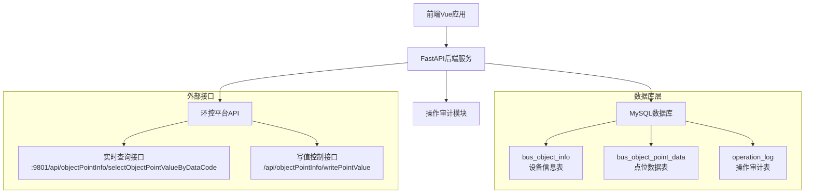

### 技术选型决策

| 组件 | 技术选择 | 选择理由 |
|------|----------|----------|
| 后端框架 | FastAPI | 高性能异步支持，自动API文档生成 |
| 数据库连接 | PyMySQL | 成熟稳定的MySQL驱动 |
| 前端框架 | Vue 3 + Element Plus | 组件化开发，丰富UI库 |
| 状态管理 | Composition API | 轻量级状态管理，适合中等规模应用 |
| HTTP客户端 | Axios | 功能完善的HTTP库，支持拦截器 |

## 核心功能设计

### 1. 点位实时值查询模块

#### 功能描述
提供设备点位的实时数据查询功能，支持单点查询和批量查询模式。

#### 接口设计

| 接口路径 | 方法 | 功能描述 |
|----------|------|----------|
| `/control/points/real-time` | GET | 单点位实时值查询 |
| `/control/device-tree` | GET | 设备树结构获取 |
| `/control/points/default` | GET | 批量点位元信息查询 |

#### 查询参数

**实时值查询参数**:
- `object_code`: 设备编码 (必填)
- `data_code`: 点位编码 (必填)

**设备树查询参数**:
- `object_codes`: 设备编码列表 (可选，逗号分隔)

#### 响应数据结构

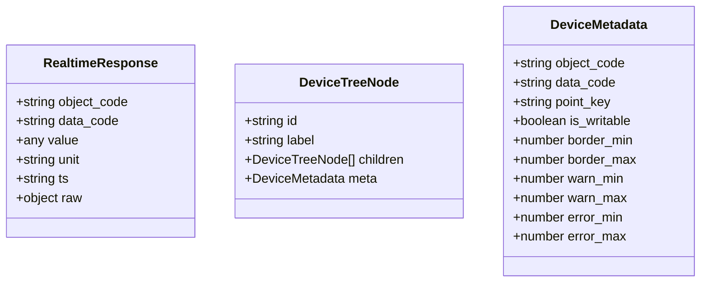

#### 数据处理流程

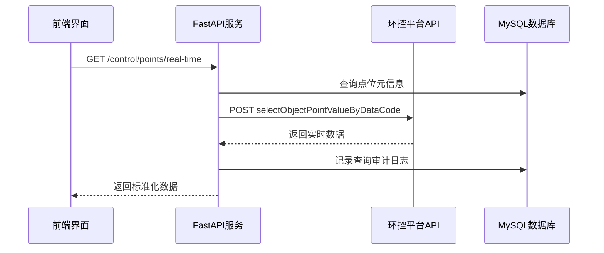

### 2. 点位写值控制下发模块

#### 功能描述
支持单个和批量设备点位的控制值下发，具备重试机制和异常处理能力。

#### 接口设计

| 接口路径 | 方法 | 功能描述 |
|----------|------|----------|
| `/control/points/write` | POST | 批量点位写值控制 |

#### 请求参数结构

**写值命令格式**:
```json
{
  "point_key": "设备:点位标识",
  "data_source": 1|2|3,
  "control_value": "控制值",
  "object_code": "设备编码(可选)",
  "data_code": "点位编码(可选)"
}
```

#### 数据验证规则

| 字段 | 验证规则 | 错误处理 |
|------|----------|----------|
| point_key | 非空字符串 | 返回验证错误 |
| data_source | 枚举值1/2/3 | 返回验证错误 |
| control_value | 数值/字符串/布尔值 | 类型自动转换 |

#### 批量控制处理机制

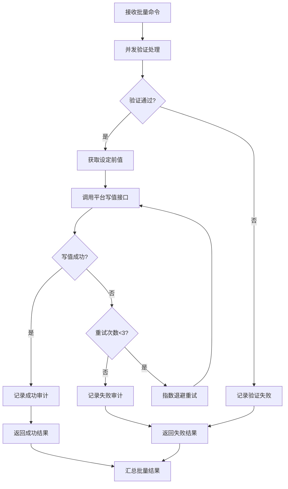

#### 重试与容错策略

| 策略类型 | 配置参数 | 实现细节 |
|----------|----------|----------|
| 重试次数 | 最大3次 | 单条命令独立重试 |
| 退避算法 | 指数退避 | 0.2 * (2^重试次数) 秒 |
| 异常隔离 | 部分失败继续 | 失败项不影响其他项执行 |
| 超时控制 | 8秒 | 单次写值请求超时时间 |

### 3. 操作审计与日志模块

#### 审计表结构设计

**operation_log 表字段定义**:

| 字段名 | 数据类型 | 说明 | 约束 |
|--------|----------|------|------|
| id | BIGINT | 主键ID | AUTO_INCREMENT |
| operator_id | VARCHAR(64) | 操作员标识 | NOT NULL |
| point_key | VARCHAR(255) | 点位标识 | NOT NULL |
| object_code | VARCHAR(128) | 设备编码 | NULL |
| data_code | VARCHAR(128) | 点位编码 | NULL |
| before_value | VARCHAR(255) | 修改前值 | NULL |
| after_value | VARCHAR(255) | 修改后值 | NULL |
| result | VARCHAR(16) | 操作结果 | NOT NULL |
| message | TEXT | 错误信息 | NULL |
| duration_ms | INT | 执行耗时(毫秒) | NULL |
| created_at | TIMESTAMP | 创建时间 | DEFAULT CURRENT_TIMESTAMP |

#### 审计数据流转

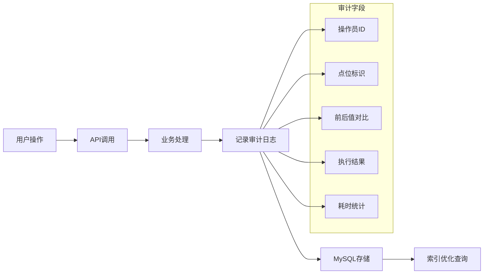

### 4. 设备树管理模块

#### 数据源设计

基于MySQL数据库构建层级设备树，支持小系统传感器数据模式。

**设备树层次结构**:
- 第一层: 项目根节点 (parent_id = 0)
- 第二层: 子项目/设备节点
- 第三层: 具体控制点位

#### 小系统传感器支持模式

| 模式类型 | 匹配规则 | 用途说明 |
|----------|----------|----------|
| 小风机频率 | `fSmallFan%` | 小系统送风机、回风机频率 |
| 室内温度 | `fRoomTemp%` | 房间温湿度传感器 |
| 高温报警 | `fSmallHigh%`, `iSmallHigh%` | 高温阈值设定与状态 |
| 低温报警 | `fSmallLow%`, `iSmallLow%` | 低温阈值设定与状态 |
| 制冷控制 | `fSmallChil%` | 制冷设备控制参数 |

#### 设备树查询优化

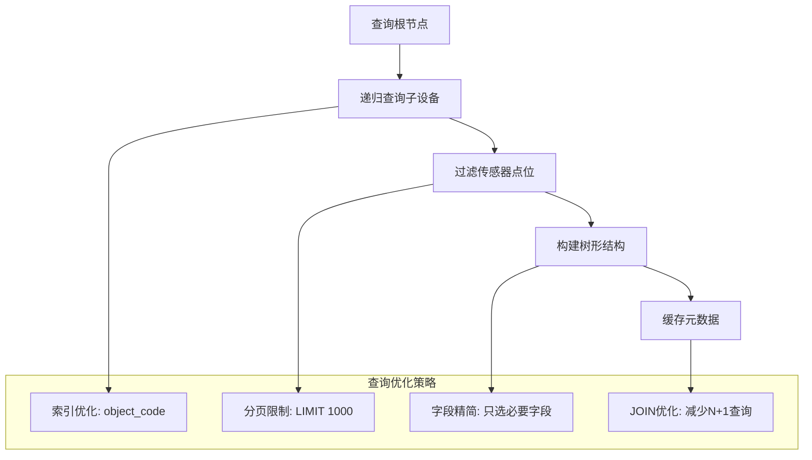

## 数据模型设计

### 核心实体关系

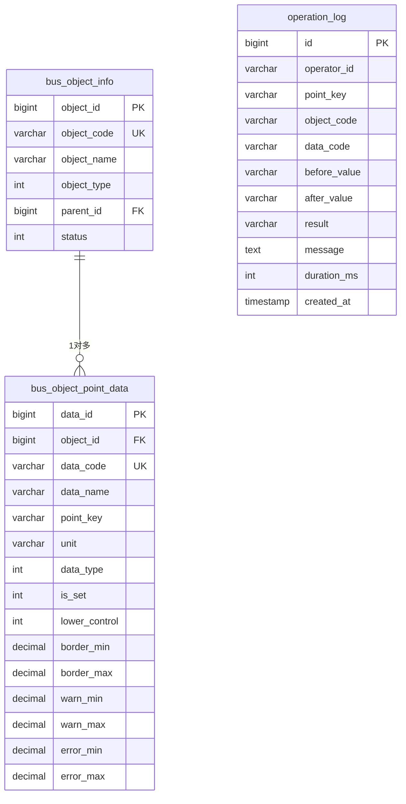

### 接口数据传输对象

#### 前端状态管理模型

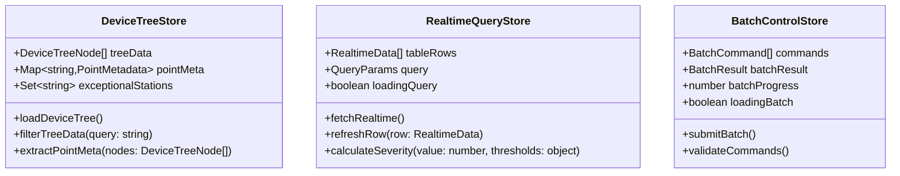

## API接口规范

### 认证与授权

#### Token配置
- **固定Token**: `eyJhbGciOiJIUzUxMiJ9...` (固定配置用于环控平台访问)
- **权限范围**: 所有车站具备读写权限
- **Token获取**: 支持动态登录刷新(缓存20分钟)

#### 请求头规范
```http
Authorization: Bearer {token}
X-Operator-Id: {操作员标识}
Content-Type: application/json
```

### 接口详细定义

#### 1. 设备树获取接口

**请求**: `GET /control/device-tree`

**响应示例**:
```json
{
  "tree": [
    {
      "id": "project_1",
      "label": "地铁1号线",
      "children": [
        {
          "id": "station_001",
          "label": "车站001",
          "meta": {
            "object_code": "station_001",
            "object_type": "station",
            "total_points": 156
          },
          "children": [
            {
              "id": "point_temp_001",
              "label": "温度传感器001",
              "meta": {
                "object_code": "station_001",
                "data_code": "fRoomTemp001",
                "point_key": "station_001:fRoomTemp001",
                "unit": "℃",
                "is_writable": false,
                "data_type": "1",
                "warn_min": 18.0,
                "warn_max": 26.0,
                "error_min": 10.0,
                "error_max": 35.0
              }
            }
          ]
        }
      ]
    }
  ],
  "count": 1
}
```

#### 2. 实时值查询接口

**请求**: `GET /control/points/real-time?object_code=station_001&data_code=fRoomTemp001`

**响应示例**:
```json
{
  "object_code": "station_001",
  "data_code": "fRoomTemp001",
  "value": 23.5,
  "unit": "℃",
  "ts": "2024-01-15T10:30:00.000Z",
  "token_len": 245,
  "raw": {
    "code": 1,
    "data": {
      "value": 23.5,
      "unit": "℃",
      "timestamp": "2024-01-15T10:30:00"
    }
  }
}
```

#### 3. 批量写值接口

**请求**: `POST /control/points/write`
```json
[
  {
    "point_key": "station_001:fRoomTempSet001",
    "data_source": 3,
    "control_value": 24.0,
    "object_code": "station_001",
    "data_code": "fRoomTempSet001"
  },
  {
    "point_key": "station_002:fSmallFan001",
    "data_source": 3,
    "control_value": 45.5
  }
]
```

**响应示例**:
```json
{
  "total": 2,
  "success": 1,
  "failed": 1,
  "items": [
    {
      "point_key": "station_001:fRoomTempSet001",
      "status": "ok",
      "message": null,
      "duration_ms": 156,
      "before": 22.0,
      "after": 24.0,
      "retries": 0
    },
    {
      "point_key": "station_002:fSmallFan001",
      "status": "failed",
      "message": "HTTP 500: 设备离线",
      "duration_ms": 8000,
      "before": 50.0,
      "after": null,
      "retries": 2
    }
  ]
}
```

## 用户界面设计

### 前端组件架构

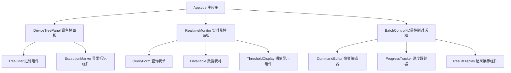

### 界面功能模块

#### 1. 设备树展示模块
- **树形结构展示**: 支持展开/折叠的层级设备树
- **智能过滤**: 实时搜索设备名称和点位编码
- **异常标记**: 红色高亮显示异常设备节点
- **点击交互**: 点击点位节点自动查询实时值

#### 2. 实时监控面板
- **查询表单**: object_code和data_code输入框
- **数据表格**: 显示点位当前值、单位、时间戳
- **阈值状态**: 彩色标签显示正常/警告/错误状态
- **刷新控制**: 单行刷新和全量刷新按钮

#### 3. 批量控制界面
- **命令编辑器**: 多行JSON格式命令输入
- **进度显示**: 实时进度条和执行状态
- **结果汇总**: 成功/失败统计和详细结果表格
- **错误处理**: 失败项错误信息展示

### 交互流程设计

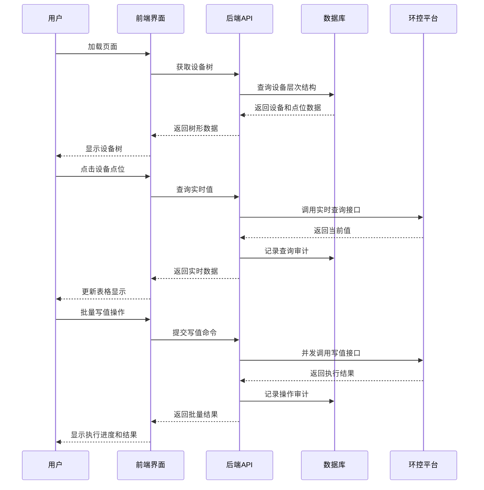

## 测试策略

### 单元测试覆盖

| 测试模块 | 测试内容 | 覆盖目标 |
|----------|----------|----------|
| 数据验证模块 | 写值参数验证逻辑 | >95% |
| 重试机制 | 指数退避算法 | >90% |
| 审计日志 | 日志记录完整性 | 100% |
| 阈值计算 | 告警级别判断 | >95% |

### 集成测试场景

#### 1. 数据库连接测试
- MySQL连接池稳定性验证
- 事务回滚机制测试
- 并发查询性能测试

#### 2. 外部接口测试
- 环控平台API可用性测试
- Token失效自动刷新测试
- 网络异常恢复测试

#### 3. 前后端集成测试
- 设备树加载完整性测试
- 实时数据刷新准确性测试
- 批量操作稳定性测试

### 性能测试指标

| 测试场景 | 性能目标 | 测试方法 |
|----------|----------|----------|
| 设备树加载 | <2秒 (1000节点) | 压力测试 |
| 实时查询响应 | <500ms (单点位) | 并发测试 |
| 批量写值处理 | <10秒 (100条命令) | 负载测试 |
| 数据库查询 | <100ms (复杂JOIN) | 索引优化测试 |

### 兼容性测试

#### 浏览器兼容性
- Chrome 90+
- Firefox 88+
- Edge 90+
- Safari 14+

#### 数据兼容性
- 小系统传感器数据格式兼容
- 历史数据迁移兼容
- 多版本API向后兼容

## 部署与运维

### 部署架构

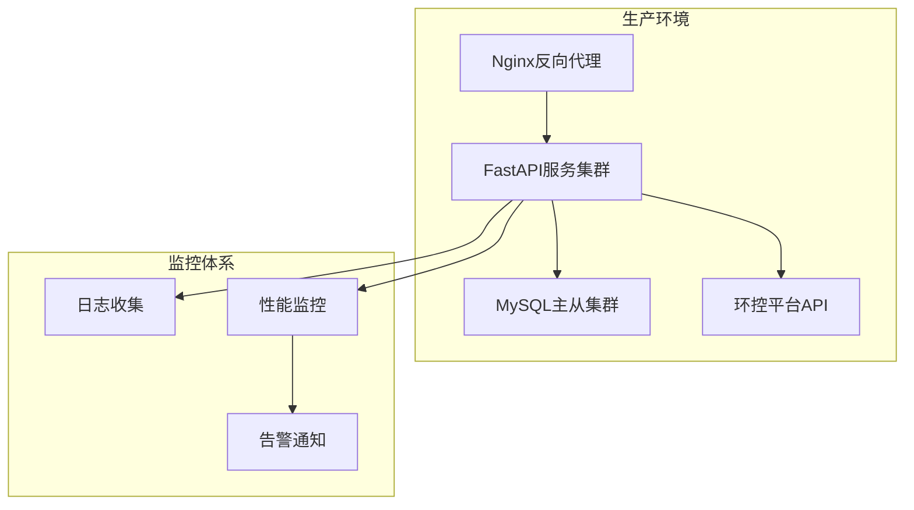

### 运维监控

#### 关键指标监控
- API响应时间 (p99 < 1秒)
- 数据库连接池使用率 (< 80%)
- 写值成功率 (> 95%)
- 审计日志完整性 (100%)

#### 告警策略
- 环控平台连接异常: 立即告警
- 数据库连接失败: 立即告警
- 批量操作失败率>10%: 延迟5分钟告警
- 磁盘空间不足: 提前告警

### 安全加固

#### 访问控制
- 操作员身份认证
- IP白名单限制
- 操作权限分级管理
- 敏感操作二次确认

#### 数据安全
- Token定期轮换
- 审计日志加密存储
- 敏感参数脱敏显示
- 数据传输HTTPS加密

### 容灾备份

#### 数据备份策略
- 数据库每日全量备份
- 操作日志实时同步备份
- 配置文件版本化管理
- 应用代码Git版本控制

#### 故障恢复
- 数据库主从自动切换
- 应用服务健康检查
- 失败操作自动重试
- 降级模式应急响应

## 扩展规划

### 短期优化(3个月)

#### 1. 点位模板配置
- **功能描述**: 预设常用控制参数组合
- **使用场景**: 温度调节、风机控制、照明管理
- **实现方式**: 配置表存储，一键应用模板

#### 2. 操作历史回放
- **功能描述**: 可视化展示历史操作轨迹
- **数据来源**: operation_log审计表
- **展示形式**: 时间轴+操作详情面板

### 中期扩展(6个月)

#### 1. 定时任务调度
- **功能描述**: 支持周期性自动控制任务
- **应用场景**: 每日温度调节、节假日模式切换
- **技术实现**: 基于APScheduler的任务调度器

#### 2. 数据分析仪表板
- **功能描述**: 设备运行状态统计分析
- **分析维度**: 故障率、能耗趋势、操作频率
- **可视化**: 图表展示+导出报表

### 长期规划(1年)

#### 1. WebSocket实时推送
- **功能描述**: 设备状态变化实时通知
- **推送内容**: 异常告警、操作结果、状态更新
- **技术架构**: WebSocket + Redis发布订阅

#### 2. AI智能诊断
- **功能描述**: 基于历史数据的故障预测
- **算法模型**: 时间序列分析+异常检测
- **应用价值**: 预防性维护、优化运营效率

#### 3. 移动端适配
- **功能描述**: 响应式设计支持移动设备
- **核心功能**: 实时监控、紧急控制、告警接收
- **技术选型**: PWA + 移动端UI适配

### 扩展架构演进

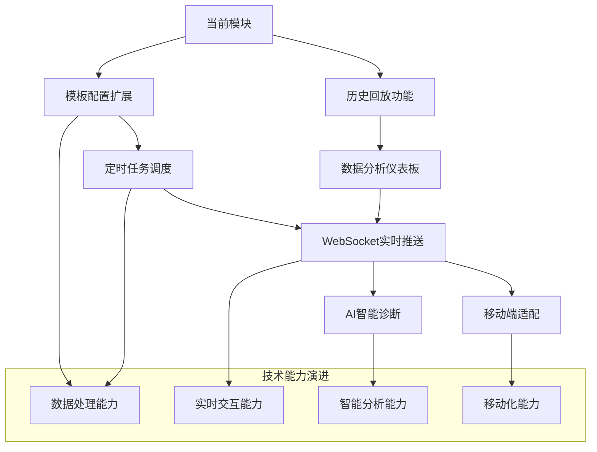