# 前端UI优化设计文档

## 概述

本设计文档针对环控平台维护工具Web版的前端界面进行全面的用户体验优化。通过分析现有界面的可用性问题，提出符合人机工程学原理和现代Web设计规范的改进方案，提升操作效率、降低学习成本，并增强系统的专业性和可靠性。

### 设计目标
- 提升界面美观度和现代感
- 优化操作流程，减少用户认知负担
- 增强信息层次结构和视觉引导
- 改善响应式设计和移动端适配
- 强化错误处理和用户反馈机制
- 提升大屏幕和多任务场景下的操作效率

## 技术栈与依赖分析

### 当前技术栈
- **前端框架**: Vue 3 (Composition API)
- **UI组件库**: Element Plus 2.3.9
- **图标库**: @element-plus/icons-vue 2.3.2
- **HTTP客户端**: Axios 1.5.0
- **构建工具**: Vite 4.4.9
- **语言**: TypeScript (API层) + JavaScript (组件层)

### 技术栈优化建议
- 保持Vue 3 + Element Plus核心架构不变
- 引入设计系统Token化管理
- 添加CSS预处理器支持自定义主题
- 集成动画库提升交互体验
- 考虑引入状态管理解决方案优化数据流

## 组件架构优化

### 当前架构分析
现有应用采用单文件组件(SFC)架构，所有功能集中在App.vue中，存在以下问题：
- 组件职责过重，可维护性差
- 缺乏组件复用和抽象
- 样式管理分散，缺乏设计一致性
- 状态管理混乱，数据流不清晰

### 优化后组件层次结构

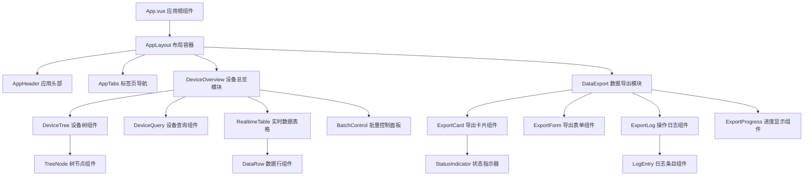

### 组件设计原则

| 组件类型 | 设计原则 | 职责范围 |
|---------|---------|---------|
| 布局组件 | 负责页面结构和导航 | 头部、侧边栏、主内容区域布局 |
| 业务组件 | 封装特定业务逻辑 | 设备控制、数据导出等功能模块 |
| 基础组件 | 可复用的UI元素 | 按钮、表单、表格、对话框等 |
| 工具组件 | 提供辅助功能 | 状态指示器、进度条、工具提示等 |

## 视觉设计系统

### 色彩系统设计

#### 主色调定义
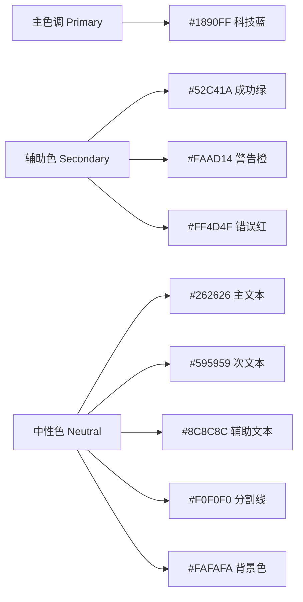

#### 语义化色彩应用

| 色彩用途 | 色值 | 应用场景 | 心理感受 |
|---------|------|---------|---------|
| 品牌主色 | #1890FF | 主要按钮、链接、重要操作 | 专业、可信赖 |
| 成功状态 | #52C41A | 操作成功、正常运行状态 | 安全、稳定 |
| 警告状态 | #FAAD14 | 需要注意的信息、临界值 | 谨慎、提醒 |
| 错误状态 | #FF4D4F | 错误信息、异常状态、危险操作 | 紧急、警惕 |
| 信息状态 | #1890FF | 一般信息提示、说明文本 | 中性、信息性 |

### 字体系统

#### 字体层级定义

| 层级 | 字号 | 行高 | 字重 | 使用场景 |
|------|------|------|------|---------|
| 标题1 | 24px | 32px | 600 | 页面主标题 |
| 标题2 | 20px | 28px | 600 | 模块标题 |
| 标题3 | 16px | 24px | 600 | 卡片标题、子标题 |
| 正文1 | 14px | 22px | 400 | 主要内容、表格数据 |
| 正文2 | 12px | 20px | 400 | 辅助信息、说明文本 |
| 小字 | 11px | 16px | 400 | 时间戳、版权信息 |

### 间距系统

采用8px基础网格系统，确保视觉一致性：

| 间距名称 | 数值 | 使用场景 |
|---------|------|---------|
| xs | 4px | 图标与文字间距、紧密排列 |
| sm | 8px | 组件内部元素间距 |
| md | 16px | 卡片内容间距、表单字段间距 |
| lg | 24px | 模块间距、卡片间距 |
| xl | 32px | 页面区块间距 |
| xxl | 48px | 页面主要区域间距 |

### 阴影系统

| 阴影级别 | CSS值 | 使用场景 |
|---------|-------|---------|
| 轻微 | 0 2px 4px rgba(0,0,0,0.1) | 按钮、输入框 |
| 标准 | 0 4px 12px rgba(0,0,0,0.1) | 卡片、下拉菜单 |
| 加深 | 0 8px 24px rgba(0,0,0,0.12) | 对话框、浮层 |
| 强调 | 0 12px 32px rgba(0,0,0,0.15) | 模态框、重要提示 |

## 界面布局优化

### 整体布局架构

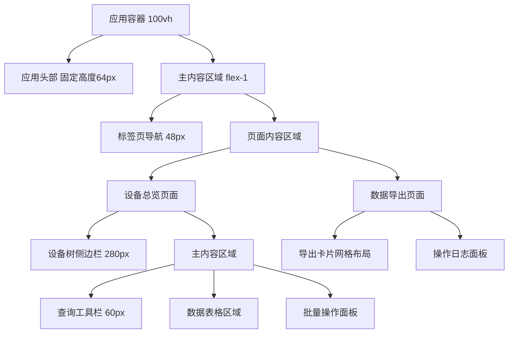

### 响应式设计策略

#### 断点定义

| 设备类型 | 断点范围 | 布局策略 | 主要调整 |
|---------|---------|---------|---------|
| 移动端 | < 768px | 单列堆叠 | 隐藏侧边栏，垂直布局 |
| 平板端 | 768px - 1024px | 混合布局 | 侧边栏可折叠，表格横向滚动 |
| 桌面端 | 1024px - 1440px | 标准布局 | 完整功能展示 |
| 大屏幕 | > 1440px | 宽屏优化 | 增加内容密度，多列展示 |

#### 移动端适配方案

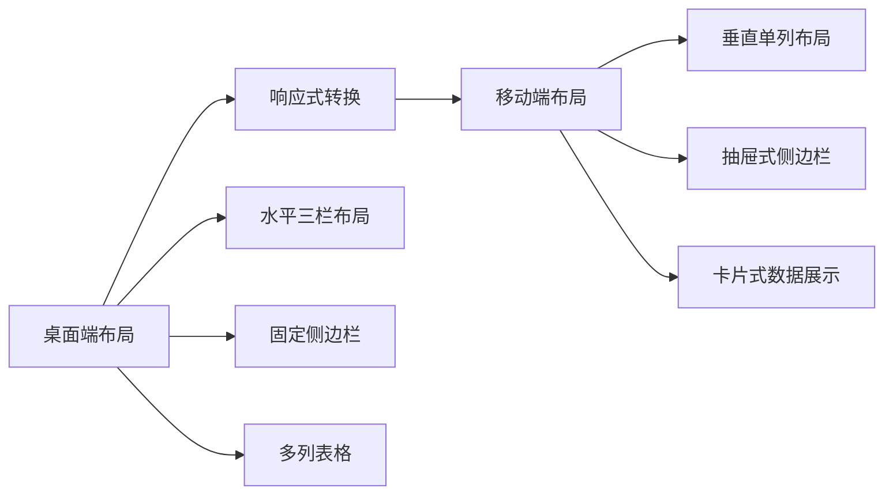

### 信息架构优化

#### 信息层次结构

| 层次级别 | 内容类型 | 视觉权重 | 设计处理 |
|---------|---------|---------|---------|
| 一级信息 | 核心数据、关键状态 | 最高 | 大字体、突出色彩、居中位置 |
| 二级信息 | 重要参数、操作按钮 | 高 | 中等字体、标准色彩、明显位置 |
| 三级信息 | 辅助数据、说明文本 | 中 | 小字体、淡化色彩、次要位置 |
| 四级信息 | 元数据、时间戳 | 低 | 最小字体、灰色、边角位置 |

## 交互设计优化

### 操作流程改进

#### 设备查询操作流程

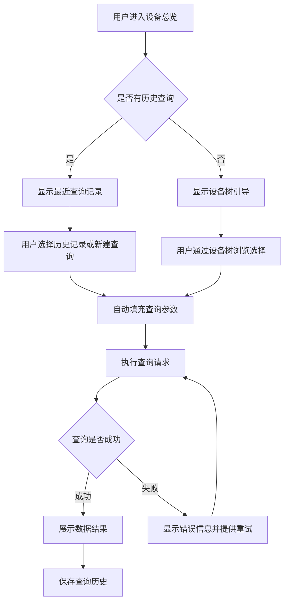

#### 批量操作流程优化

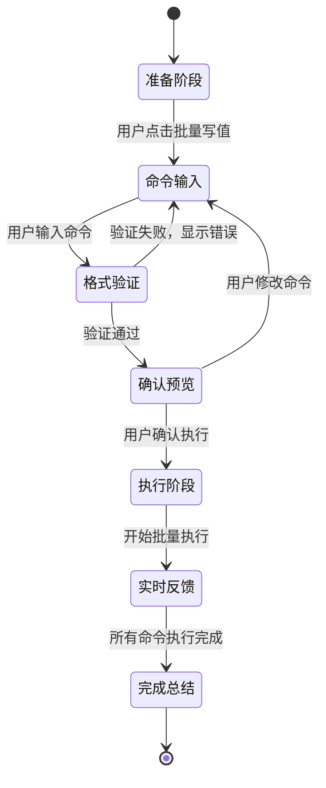

### 微交互设计

#### 加载状态设计

| 操作类型 | 加载时长预期 | 反馈方式 | 用户体验目标 |
|---------|-------------|---------|-------------|
| 设备树加载 | 1-3秒 | 骨架屏 + 进度条 | 减少等待焦虑 |
| 实时数据查询 | 0.5-2秒 | 按钮loading + 表格placeholder | 保持操作连续性 |
| 批量数据导出 | 10秒-5分钟 | 进度条 + 详细日志 + 可取消 | 提供操作控制感 |
| 文件下载 | 即时 | toast提示 + 下载状态 | 明确操作结果 |

#### 状态反馈机制

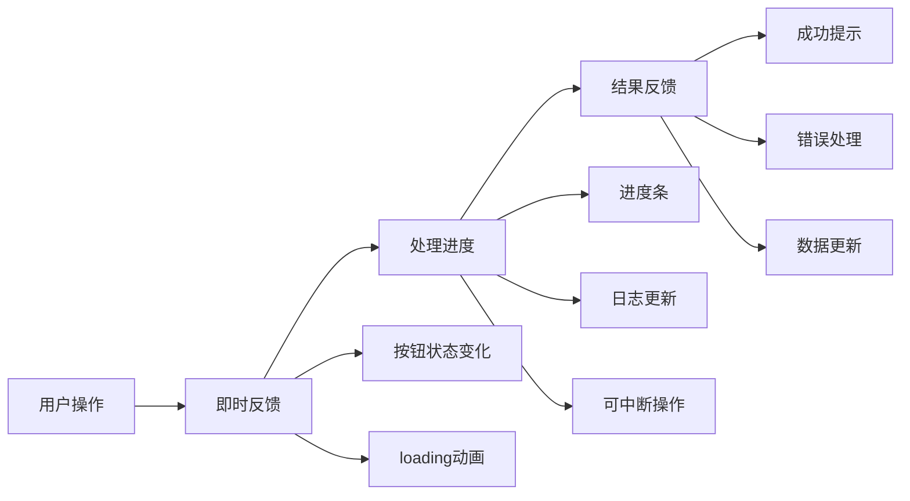

### 错误处理与用户引导

#### 错误分类与处理策略

| 错误类型 | 出现场景 | 处理策略 | 用户体验设计 |
|---------|---------|---------|-------------|
| 网络错误 | API请求失败 | 自动重试 + 手动重试 | 明确错误原因，提供解决建议 |
| 数据验证错误 | 表单输入错误 | 实时验证 + 错误高亮 | 精确定位错误位置，提供修改建议 |
| 权限错误 | 无操作权限 | 权限提示 + 联系管理员 | 友好说明权限问题，提供联系方式 |
| 业务逻辑错误 | 设备操作失败 | 详细错误信息 + 操作建议 | 技术错误转化为业务语言 |

#### 新用户引导设计

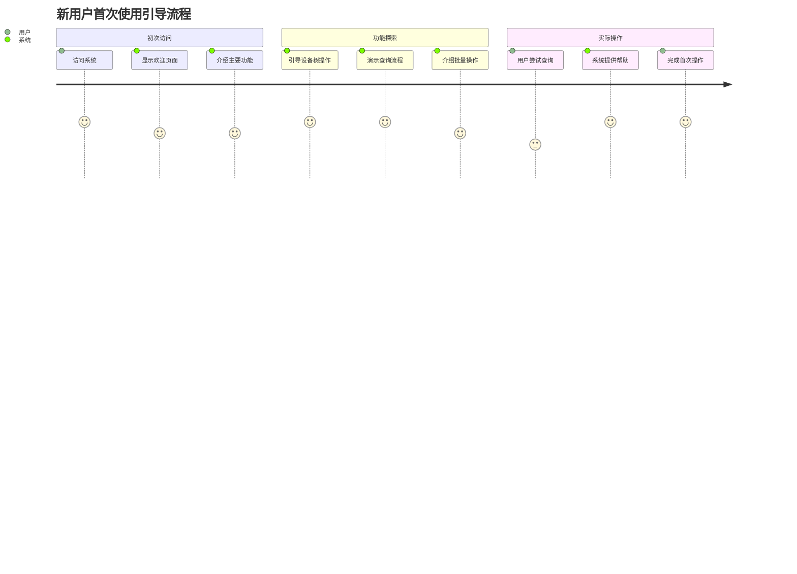

## 性能优化策略

### 渲染性能优化

#### 虚拟化处理方案

| 组件类型 | 数据规模 | 优化策略 | 性能目标 |
|---------|---------|---------|---------|
| 设备树组件 | 1000+节点 | 虚拟滚动 + 懒加载 | 首屏渲染 < 100ms |
| 数据表格 | 500+行记录 | 分页 + 虚拟化 | 滚动流畅度 60fps |
| 日志列表 | 无限增长 | 窗口化渲染 | 内存占用 < 50MB |

#### 数据更新优化

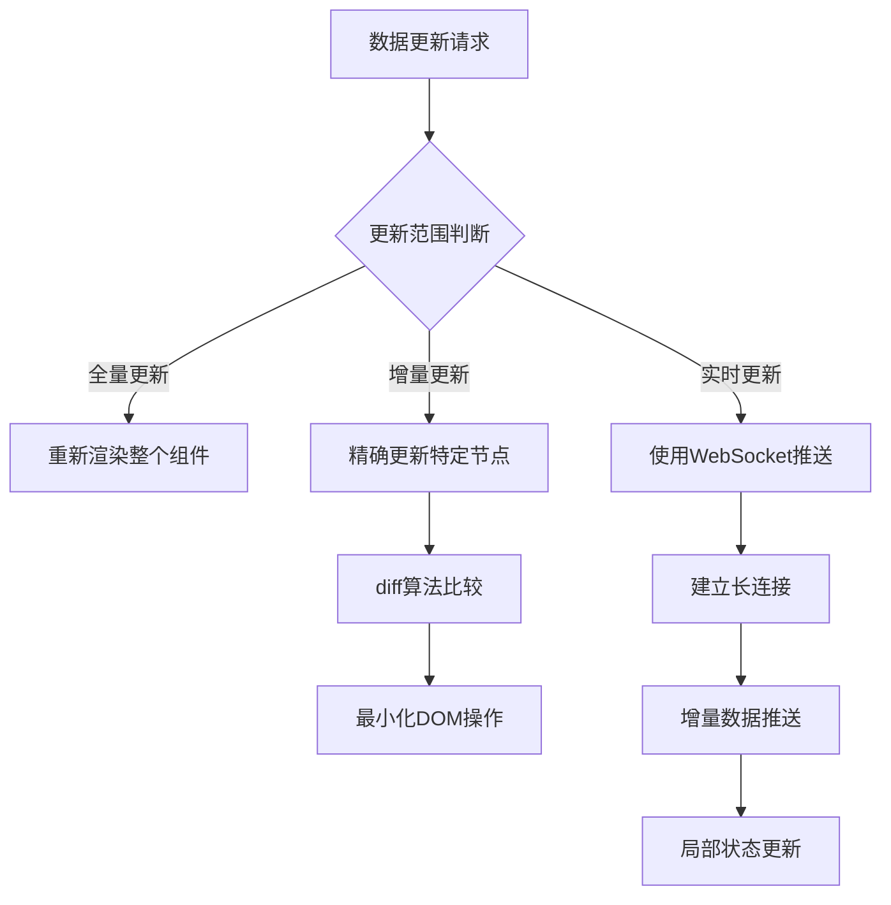

### 用户操作响应优化

#### 防抖与节流策略

| 操作类型 | 优化方法 | 参数设置 | 用户体验提升 |
|---------|---------|---------|-------------|
| 搜索输入 | 防抖 | 300ms延迟 | 减少无意义请求 |
| 窗口缩放 | 节流 | 100ms间隔 | 保持响应式流畅 |
| 滚动事件 | 节流 | 16ms间隔 | 维持60fps体验 |
| 按钮点击 | 防重复 | 500ms锁定 | 防止误操作 |

## 可访问性设计

### 键盘导航支持

#### 焦点管理策略

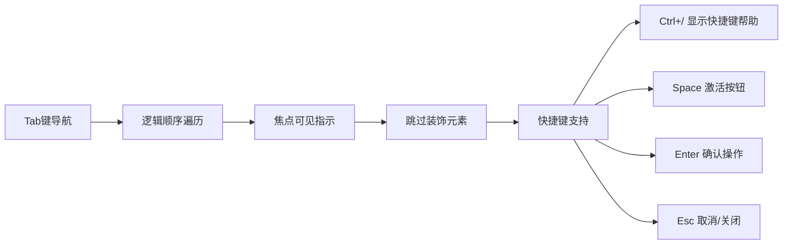

### 屏幕阅读器支持

| 元素类型 | 可访问性属性 | 实现方式 | 用户体验 |
|---------|-------------|---------|---------|
| 数据表格 | aria-label, role | 添加语义化标签 | 清晰表达表格结构和内容 |
| 状态指示 | aria-live | 动态状态播报 | 及时了解系统状态变化 |
| 表单控件 | aria-describedby | 关联错误信息 | 明确表单验证结果 |
| 导航菜单 | aria-expanded | 展开状态提示 | 了解菜单当前状态 |

### 色彩对比度优化

确保所有文本和背景的对比度符合WCAG 2.1标准：
- 正常文本：对比度不低于4.5:1
- 大字体文本：对比度不低于3:1
- 重要信息：对比度不低于7:1

## 用户体验测试策略

### 可用性测试计划

#### 测试场景设计

| 测试场景 | 用户任务 | 成功标准 | 观察要点 |
|---------|---------|---------|---------|
| 新用户初次使用 | 完成一次设备查询 | 5分钟内完成，无需帮助 | 困惑点、操作路径、错误类型 |
| 日常运维操作 | 批量控制10个设备 | 3分钟内完成，错误率<5% | 操作效率、错误恢复、心理模型 |
| 异常情况处理 | 网络中断后恢复操作 | 能够理解状态并正确恢复 | 错误理解、恢复策略、情绪反应 |
| 大数据量处理 | 导出1000+设备数据 | 10分钟内完成，界面保持响应 | 性能感知、进度理解、操作信心 |

#### 测试指标定义

| 指标类型 | 具体指标 | 目标值 | 测量方法 |
|---------|---------|-------|----------|
| 效率指标 | 任务完成时间 | 较现有版本提升30% | 时间记录 |
| 准确性指标 | 操作错误率 | < 5% | 错误统计 |
| 满意度指标 | SUS可用性评分 | > 75分 | 问卷调查 |
| 学习成本 | 新用户上手时间 | < 10分钟 | 观察记录 |

### A/B测试设计

#### 关键界面对比测试

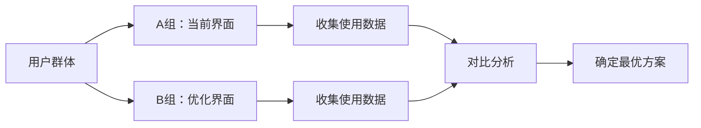

| 测试维度 | A组方案 | B组方案 | 评判标准 |
|---------|---------|---------|----------|
| 导航方式 | Tab切换 | 侧边栏导航 | 点击效率、用户偏好 |
| 数据展示 | 表格形式 | 卡片形式 | 信息获取速度、视觉疲劳度 |
| 操作反馈 | 简单提示 | 丰富动画 | 操作确信度、界面流畅感 |

## 实施计划与优先级

### 优化阶段划分

#### 第一阶段：基础体验优化（高优先级）
- **持续时间**: 2周
- **核心目标**: 解决影响日常使用的关键问题
- **主要内容**:
  - 色彩系统标准化应用
  - 字体层级和间距规范化
  - 加载状态和错误提示优化
  - 移动端基础适配

#### 第二阶段：交互体验提升（中优先级）
- **持续时间**: 3周
- **核心目标**: 提升操作效率和用户满意度
- **主要内容**:
  - 组件模块化重构
  - 微交互和动画效果
  - 快捷键和键盘导航
  - 批量操作流程优化

#### 第三阶段：高级功能完善（低优先级）
- **持续时间**: 2周
- **核心目标**: 增强专业性和可扩展性
- **主要内容**:
  - 主题定制和个性化设置
  - 高级数据可视化
  - 性能监控和优化
  - 可访问性功能完善

### 技术实施路径

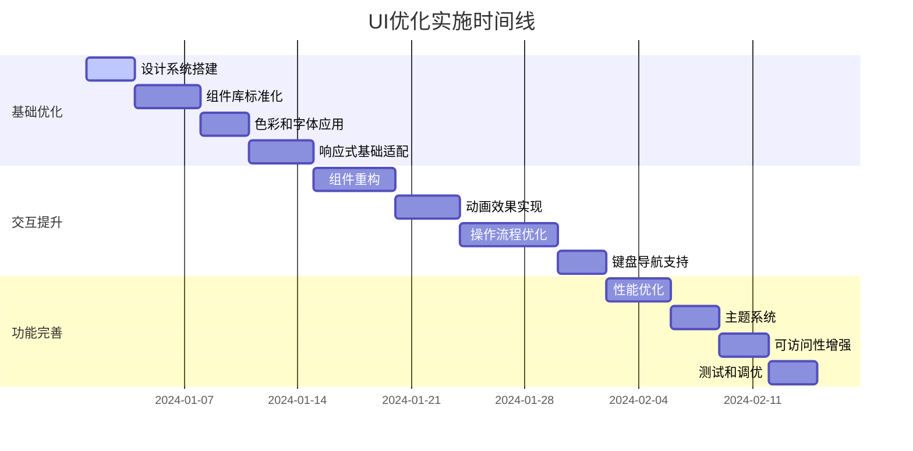

### 成功标准定义

#### 量化指标

| 指标类别 | 当前基线 | 目标值 | 测量方式 |
|---------|---------|-------|----------|
| 页面加载时间 | 2-3秒 | < 1.5秒 | 性能监控工具 |
| 任务完成效率 | 基线测试 | 提升25% | 用户测试 |
| 界面错误率 | 15% | < 8% | 错误日志统计 |
| 用户满意度 | 待测试 | > 4.2/5.0 | 问卷调查 |

#### 定性评估

- **视觉一致性**: 所有界面元素遵循统一设计规范
- **操作直观性**: 新用户能够无指导完成基本操作
- **信息清晰度**: 关键信息突出，次要信息适当弱化
- **响应及时性**: 所有用户操作都有即时反馈
- **错误友好性**: 错误信息准确、易懂，提供解决方案

## 风险评估与应对

### 技术风险分析

| 风险类型 | 影响程度 | 发生概率 | 风险描述 | 应对策略 |
|---------|---------|---------|---------|----------|
| 兼容性问题 | 高 | 中 | 新版本组件与现有功能冲突 | 渐进式升级、充分测试 |
| 性能回退 | 中 | 低 | 优化后性能反而下降 | 性能基准测试、分阶段发布 |
| 用户接受度 | 中 | 中 | 用户不适应新界面 | 用户培训、渐进式改变 |
| 开发周期 | 低 | 高 | 实施时间超过预期 | 优先级管理、MVP策略 |

### 回退方案

#### 版本管理策略
- 保持当前版本的完整备份
- 采用特性开关(Feature Flag)控制新功能上线
- 建立快速回退机制，支持单一功能回退
- 设置用户反馈通道，及时收集问题

#### 渐进式发布计划

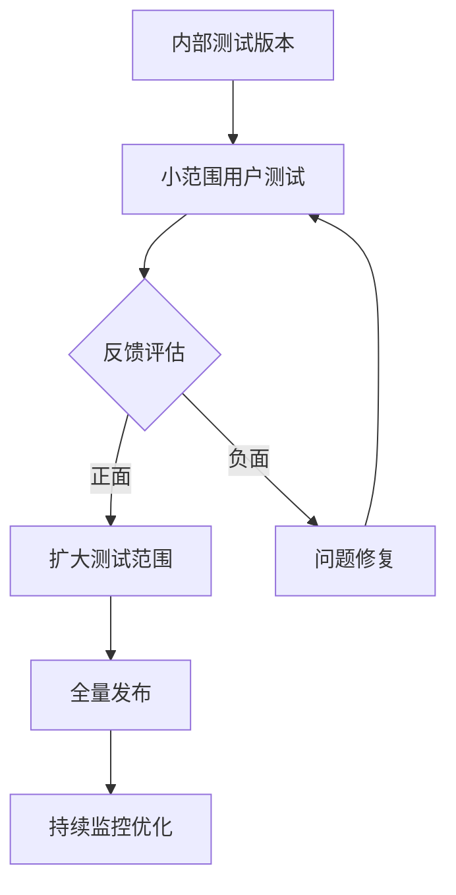

## 长期维护与演进

### 设计系统持续优化

#### 反馈收集机制
- **用户行为分析**: 通过埋点数据了解真实使用情况
- **定期用户访谈**: 深度了解用户需求变化
- **A/B测试验证**: 持续验证设计假设
- **行业趋势跟踪**: 关注UI/UX设计发展趋势

#### 技术栈演进规划

| 时间阶段 | 技术重点 | 主要目标 |
|---------|---------|----------|
| 近期(3个月) | 现有框架优化 | 稳定性和性能提升 |
| 中期(6个月) | 新技术试点 | 前瞻性功能验证 |
| 长期(1年) | 架构升级 | 适应业务发展需求 |

### 团队能力建设

#### 设计规范培训
- 组织设计系统使用培训
- 建立代码审查机制
- 定期分享最佳实践
- 建立UI组件贡献流程

#### 工具和流程优化
- 引入设计稿到代码的自动化转换工具
- 建立设计token管理系统
- 完善UI测试自动化流程
- 建立性能监控和报警机制