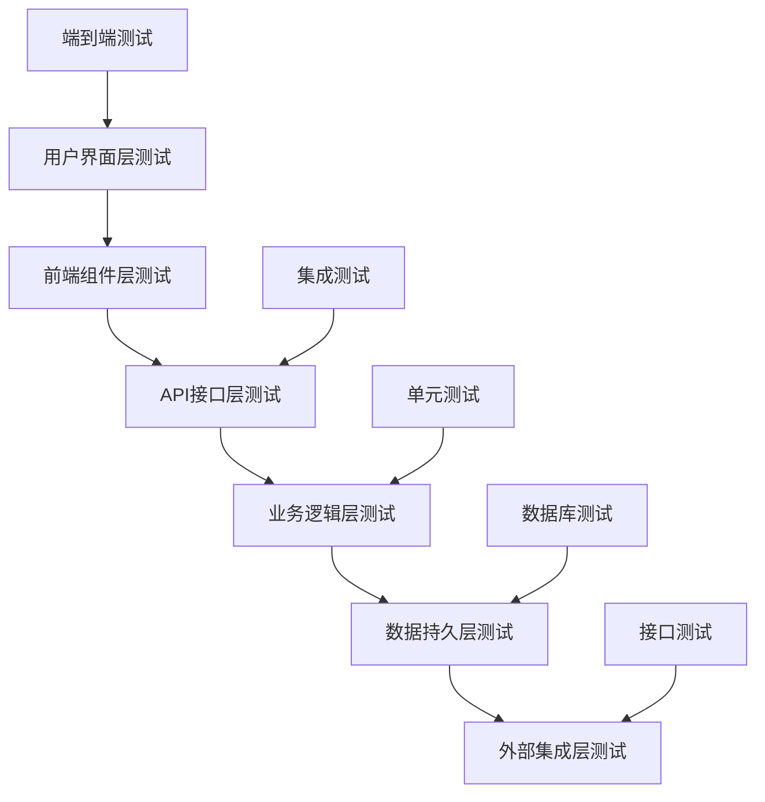
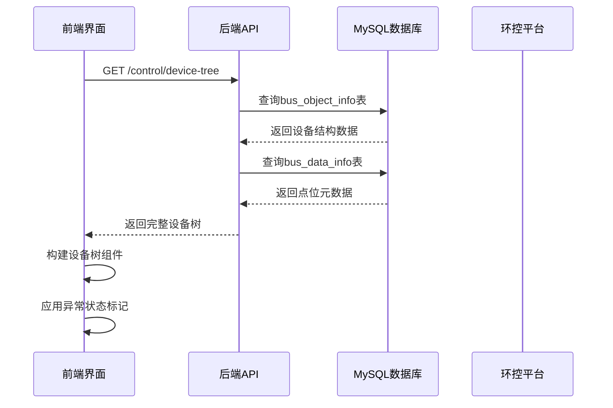
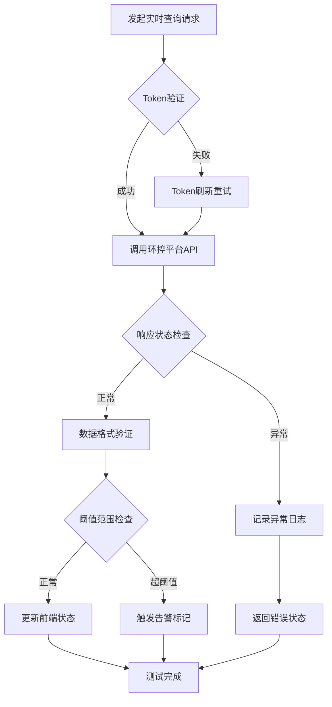
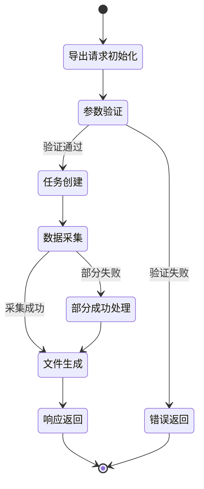
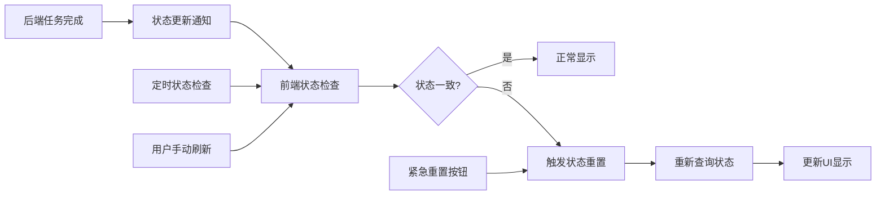
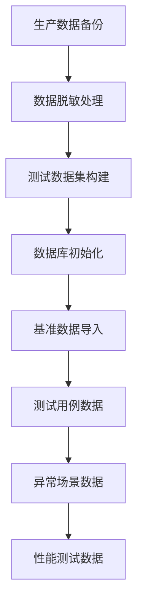
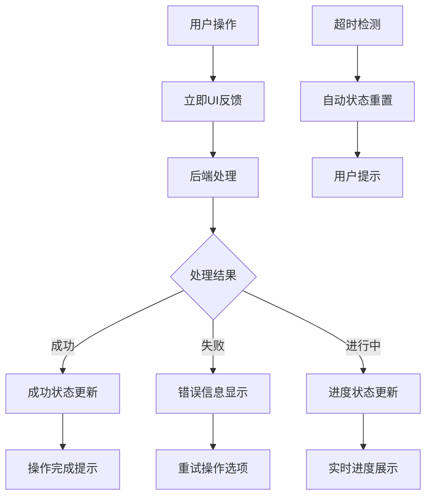
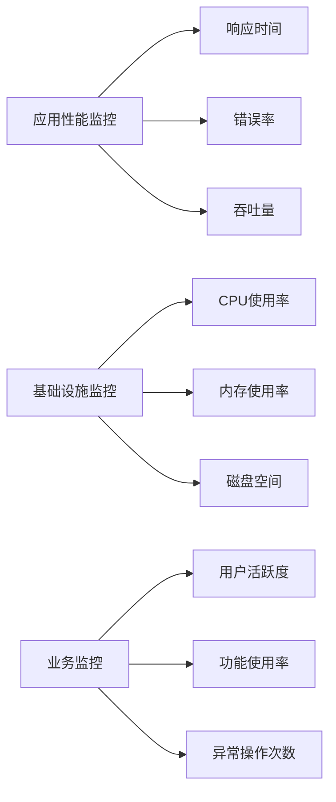

# 环控节能平台设备点位运维与批量控制模块功能测试及问题修复设计

## 概述

本设计文档针对环控节能平台设备点位运维与批量控制模块进行完整的前后端功能测试及问题修复方案设计。系统为Vue3+FastAPI全栈应用，包含设备树管理、实时数据查询、批量写值控制、数据导出、操作审计等核心功能模块。

### 系统架构识别

- **前端技术栈**: Vue 3 + Element Plus + Vite (localhost:3000)
- **后端技术栈**: FastAPI + SQLAlchemy + MySQL (localhost:8000)
- **核心模块**: 设备控制、数据导出、状态同步、审计日志
- **集成接口**: 环控平台API (192.168.100.3:9801)

## 测试策略与架构

### 测试分层架构

### 功能模块测试矩阵

| 功能模块 | 前端测试 | 后端测试 | 集成测试 | 状态同步测试 | 异常处理测试 |
|---------|---------|---------|---------|-------------|-------------|
| 设备树管理 | ✓ | ✓ | ✓ | ✓ | ✓ |
| 实时数据查询 | ✓ | ✓ | ✓ | ✓ | ✓ |
| 批量写值控制 | ✓ | ✓ | ✓ | ✓ | ✓ |
| 数据导出功能 | ✓ | ✓ | ✓ | ✓ | ✓ |
| 操作审计日志 | ✓ | ✓ | ✓ | ✓ | ✓ |
| 状态同步机制 | ✓ | ✓ | ✓ | ✓ | ✓ |

## 核心功能测试设计

### 设备树管理功能测试

#### 测试场景覆盖
- 设备树数据加载与渲染验证
- 设备筛选与搜索功能测试
- 节点展开/折叠状态管理
- 异常站点红标显示逻辑
- 设备元数据映射准确性

#### 测试数据流验证

#### 前端组件测试要点
- ElTree组件数据绑定正确性
- 设备筛选算法效率验证
- 异常状态样式应用逻辑
- 节点点击事件处理机制

### 实时数据查询功能测试

#### API接口测试规范
- Token认证机制有效性验证
- 请求参数格式规范性检查
- 响应数据结构完整性验证
- 超时处理与重试机制测试

#### 数据质量验证流程

### 批量写值控制功能测试

#### 并发控制测试策略
- 多点位同时写值操作验证
- 部分失败不中断机制测试
- 重试逻辑与次数限制验证
- 操作进度实时反馈测试

#### 写值操作审计测试

| 测试项目 | 验证内容 | 预期结果 |
|---------|---------|---------|
| 操作记录完整性 | 时间戳、操作员ID、前后值 | 数据库记录准确 |
| 操作状态追踪 | 成功/失败状态记录 | 状态同步一致 |
| 异常情况处理 | 网络异常、平台异常 | 错误信息详细 |
| 权限验证机制 | 操作员权限检查 | 未授权操作拒绝 |

### 数据导出功能测试

#### 导出流程完整性验证

#### 超时处理机制测试
- API请求超时设置合理性
- 长时间任务进度反馈
- 前端状态卡住问题预防
- 紧急状态重置功能验证

## 状态同步问题诊断与修复

### 前后端状态不一致问题分析

#### 常见状态同步失效场景
- 导出任务完成但前端按钮仍显示loading状态
- 后端任务成功但前端未收到完成通知
- 网络异常导致状态更新丢失
- 浏览器页面长时间未刷新导致状态滞后

#### 状态同步机制设计

### 诊断工具设计方案

#### 独立诊断页面功能
- 系统状态全面检查
- 网络连接质量测试
- 前后端服务通信验证
- 状态同步异常定位
- 自动修复建议提供

#### 诊断检查项目清单

| 检查类别 | 检查项目 | 检查方法 | 异常处理 |
|---------|---------|---------|---------|
| 网络连接 | 前端服务可达性 | HTTP请求测试 | 连接重试 |
| 网络连接 | 后端服务可达性 | API接口调用 | 服务状态提示 |
| 网络连接 | 外部平台连通性 | 环控平台ping测试 | 网络路由检查 |
| 服务状态 | 前端应用状态 | 页面响应性测试 | 页面刷新建议 |
| 服务状态 | 后端服务状态 | 健康检查接口 | 服务重启提示 |
| 数据状态 | 本地存储状态 | localStorage检查 | 缓存清理 |
| 数据状态 | 会话状态验证 | Token有效性检查 | 重新登录 |

## 自动化测试框架设计

### 前端测试架构

#### 组件单元测试设计
- Vue组件挂载与渲染测试
- 用户交互事件模拟验证
- 状态管理响应性测试
- API调用Mock机制

#### 端到端测试场景
- 完整业务流程自动化测试
- 多浏览器兼容性验证
- 响应式设计适配测试
- 性能基准测试

### 后端测试架构

#### API接口测试设计
- 请求参数验证测试
- 响应数据格式验证
- 错误处理机制测试
- 性能负载测试

#### 数据库集成测试
- 数据CRUD操作验证
- 事务完整性测试
- 并发访问安全测试
- 数据一致性验证

### 测试数据管理策略

#### 测试环境数据准备

#### 数据隔离与清理机制
- 测试环境独立数据库
- 每次测试前数据重置
- 测试完成后数据清理
- 测试数据版本管理

## 性能测试与优化设计

### 前端性能测试要点

#### 页面加载性能指标
- 首次内容绘制时间(FCP)
- 最大内容绘制时间(LCP)
- 累积布局偏移(CLS)
- 首次输入延迟(FID)

#### 组件渲染性能优化
- 虚拟滚动列表实现
- 组件懒加载机制
- 数据缓存策略优化
- 事件处理防抖节流

### 后端性能测试要点

#### API响应性能基准

| API类型 | 响应时间目标 | 并发用户数 | 测试场景 |
|---------|-------------|-----------|---------|
| 设备树查询 | < 500ms | 50 | 正常负载 |
| 实时数据查询 | < 200ms | 100 | 高频查询 |
| 批量写值操作 | < 2s | 20 | 并发写入 |
| 数据导出任务 | < 30s | 10 | 大数据量 |

#### 数据库查询优化验证
- 索引使用效率分析
- 查询执行计划优化
- 连接池配置调优
- 缓存命中率提升

## 问题修复实施方案

### 高优先级问题修复

#### 状态同步失效修复
- 实现WebSocket实时通信机制
- 增加定时状态检查轮询
- 提供手动状态重置功能
- 完善异常状态恢复逻辑

#### 网络异常处理优化
- 实现请求重试机制
- 优化超时参数配置
- 增强错误信息展示
- 提供离线状态提示

### 用户体验优化修复

#### 操作反馈改进方案

#### 界面交互优化
- 加载状态优化显示
- 操作结果明确反馈
- 错误信息友好提示
- 操作指引清晰展示

## 测试执行计划

### 测试阶段划分

#### 第一阶段：基础功能验证(2天)
- 服务启动与健康检查
- 基础API接口测试
- 数据库连接验证
- 前端页面加载测试

#### 第二阶段：核心功能测试(3天)
- 设备树管理功能测试
- 实时数据查询测试
- 批量写值控制测试
- 数据导出功能测试

#### 第三阶段：集成与性能测试(2天)
- 前后端集成测试
- 状态同步机制测试
- 性能负载测试
- 异常场景测试

#### 第四阶段：问题修复与回归(2天)
- 问题定位与修复
- 修复效果验证
- 回归测试执行
- 最终验收测试

### 测试环境配置

#### 环境依赖清单

| 组件 | 版本要求 | 配置要求 | 验证方法 |
|------|---------|---------|---------|
| Node.js | >= 16.0 | 4GB内存 | node --version |
| Python | >= 3.8 | 支持asyncio | python --version |
| MySQL | >= 8.0 | InnoDB引擎 | SELECT VERSION() |
| Vue DevTools | 最新版 | 浏览器扩展 | 开发者工具检查 |

#### 测试数据准备脚本
- 数据库表结构初始化
- 基础配置数据导入
- 测试设备点位数据
- 模拟运行状态数据

## 测试报告与验收标准

### 测试覆盖率要求

#### 代码覆盖率目标
- 前端组件覆盖率 >= 80%
- 后端API覆盖率 >= 90%
- 业务逻辑覆盖率 >= 95%
- 集成测试覆盖率 >= 85%

#### 功能覆盖率验证
- 正常功能路径100%覆盖
- 异常处理路径80%覆盖
- 边界条件测试完整
- 性能要求验证达标

### 验收标准定义

#### 功能完整性标准
- 所有核心功能正常运行
- 数据准确性100%保证
- 操作响应时间达标
- 异常处理机制完善

#### 稳定性保证标准
- 7x24小时稳定运行
- 并发访问无异常
- 数据一致性保证
- 系统恢复能力验证

### 持续监控机制

#### 生产环境监控指标

#### 告警阈值配置
- API响应时间超过2秒告警
- 错误率超过5%告警
- 系统资源使用率超过80%告警
- 关键业务功能异常立即告警

通过本设计文档的实施，确保环控节能平台设备点位运维与批量控制模块的功能完整性、稳定性和用户体验质量，建立完善的测试体系和问题修复机制，为系统的持续稳定运行提供保障。