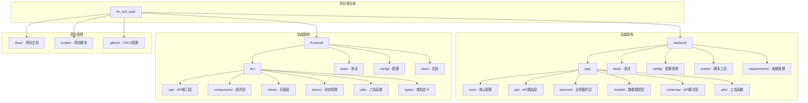
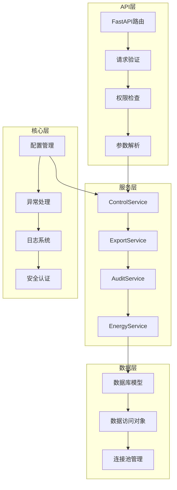
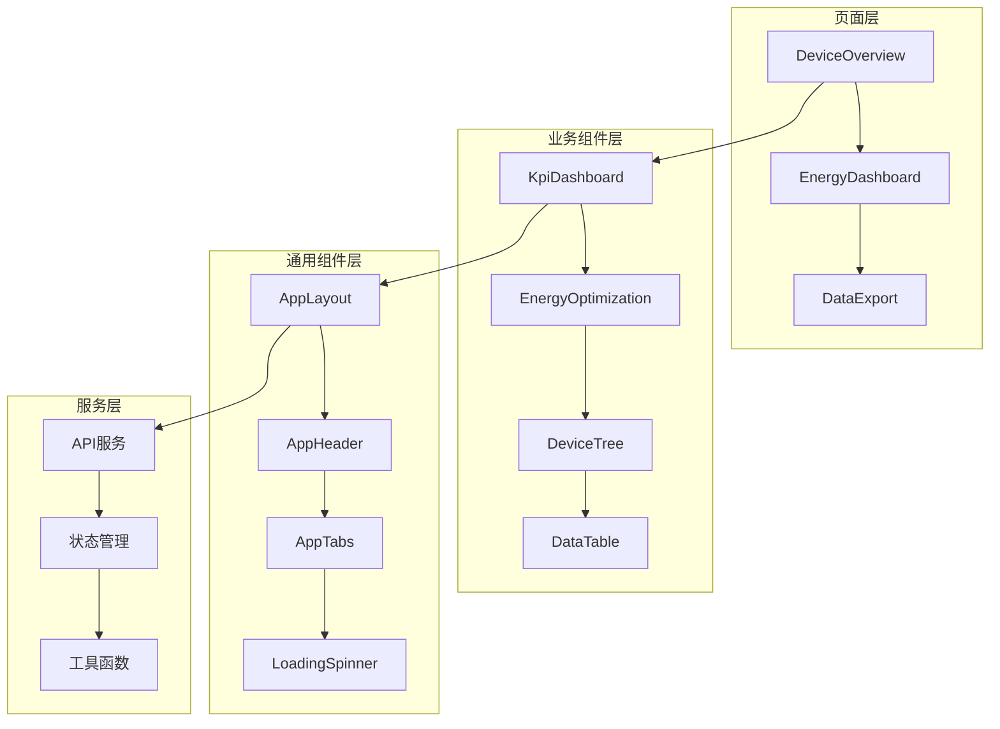
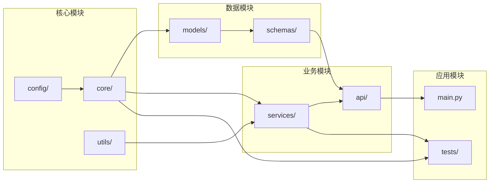
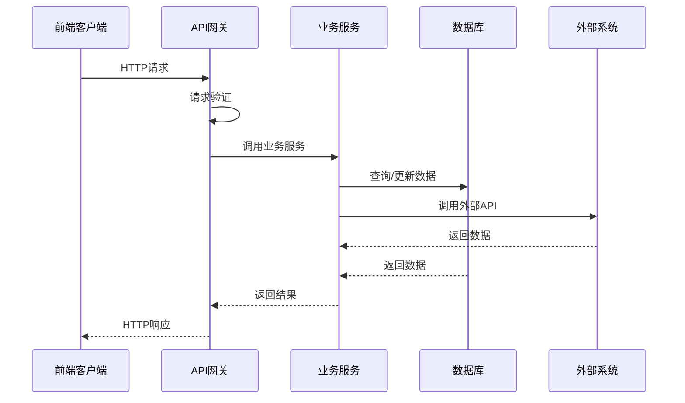
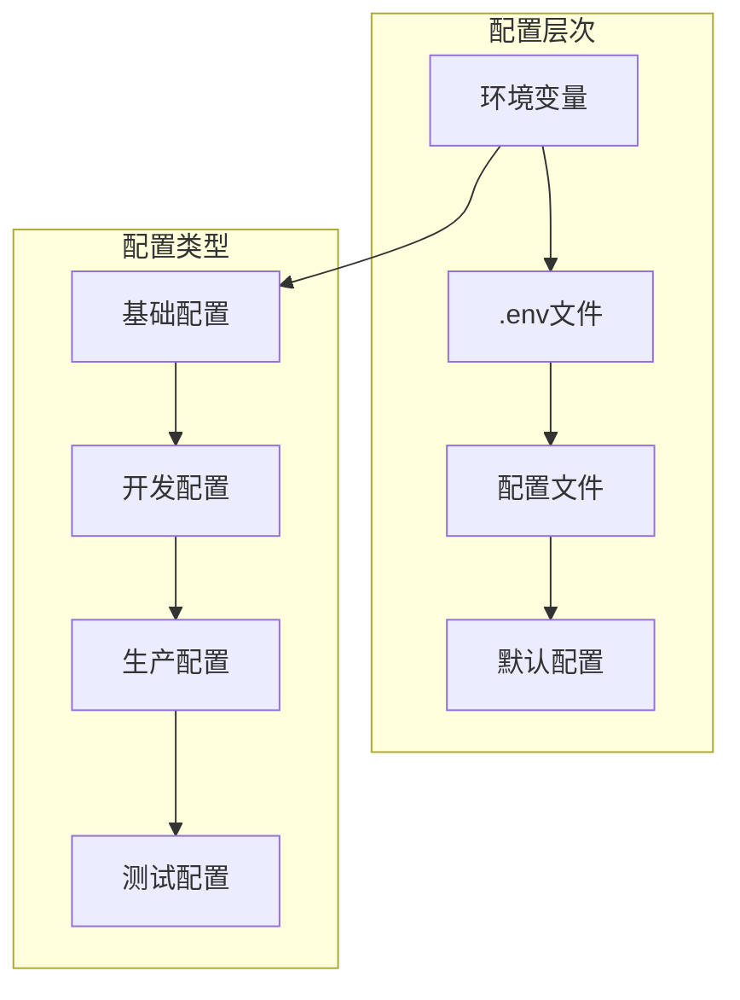
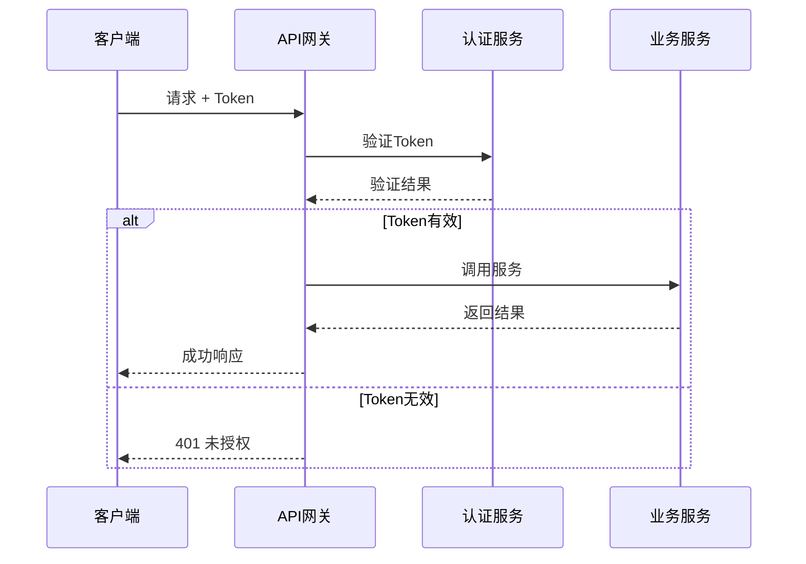
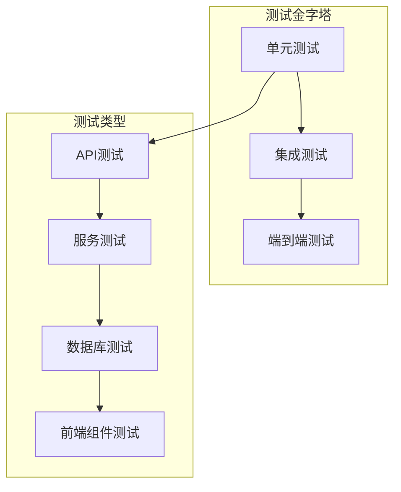

# 工程结构优化设计文档

## 整体架构图



## 分层设计和核心组件

### 1. 后端分层架构



### 2. 前端组件架构



## 模块依赖关系图



## 接口契约定义

### 1. 服务层接口

```python
# services/base.py
from abc import ABC, abstractmethod
from typing import Any, Dict, List, Optional

class BaseService(ABC):
    """基础服务接口"""
    
    @abstractmethod
    async def initialize(self) -> None:
        """服务初始化"""
        pass
    
    @abstractmethod
    async def cleanup(self) -> None:
        """服务清理"""
        pass

# services/control_service.py
class IControlService(BaseService):
    """设备控制服务接口"""
    
    @abstractmethod
    async def get_device_tree(self, station_ip: str) -> Dict[str, Any]:
        """获取设备树"""
        pass
    
    @abstractmethod
    async def query_points(self, point_keys: List[str]) -> List[Dict[str, Any]]:
        """查询点位数据"""
        pass
    
    @abstractmethod
    async def write_point(self, point_key: str, value: Any) -> Dict[str, Any]:
        """写入点位值"""
        pass
```

### 2. API层接口

```python
# api/v1/endpoints/control.py
from fastapi import APIRouter, Depends, HTTPException
from typing import List
from schemas.control import DeviceTreeResponse, PointQueryRequest, PointWriteRequest

router = APIRouter()

@router.get("/device-tree", response_model=DeviceTreeResponse)
async def get_device_tree(
    station_ip: str,
    service: IControlService = Depends(get_control_service)
):
    """获取设备树接口"""
    pass

@router.post("/points/query")
async def query_points(
    request: PointQueryRequest,
    service: IControlService = Depends(get_control_service)
):
    """查询点位接口"""
    pass
```

### 3. 前端API接口

```typescript
// api/types.ts
export interface DeviceTreeNode {
  id: string;
  label: string;
  children?: DeviceTreeNode[];
  type: 'device' | 'point';
}

export interface PointData {
  pointKey: string;
  value: any;
  timestamp: string;
  quality: string;
}

// api/control.ts
export interface IControlAPI {
  getDeviceTree(stationIp: string): Promise<DeviceTreeNode[]>;
  queryPoints(pointKeys: string[]): Promise<PointData[]>;
  writePoint(pointKey: string, value: any): Promise<boolean>;
}
```

## 数据流向图



## 异常处理策略

### 1. 分层异常处理

```python
# core/exceptions.py
class BaseException(Exception):
    """基础异常类"""
    def __init__(self, message: str, code: str = None):
        self.message = message
        self.code = code
        super().__init__(self.message)

class BusinessException(BaseException):
    """业务异常"""
    pass

class ValidationException(BaseException):
    """验证异常"""
    pass

class ExternalServiceException(BaseException):
    """外部服务异常"""
    pass

# api/exception_handlers.py
from fastapi import Request, HTTPException
from fastapi.responses import JSONResponse

async def business_exception_handler(request: Request, exc: BusinessException):
    return JSONResponse(
        status_code=400,
        content={
            "error": {
                "code": exc.code,
                "message": exc.message,
                "type": "business_error"
            }
        }
    )
```

### 2. 前端错误处理

```typescript
// utils/error-handler.ts
export interface ApiError {
  code: string;
  message: string;
  type: string;
}

export class ErrorHandler {
  static handle(error: any): void {
    if (error.response?.data?.error) {
      const apiError: ApiError = error.response.data.error;
      this.showError(apiError);
    } else {
      this.showError({
        code: 'UNKNOWN_ERROR',
        message: '未知错误',
        type: 'system_error'
      });
    }
  }
  
  private static showError(error: ApiError): void {
    // 显示错误信息的逻辑
  }
}
```

## 配置管理架构

### 1. 配置层次结构



### 2. 配置加载机制

```python
# config/settings/base.py
from pydantic import BaseSettings
from typing import Optional

class BaseSettings(BaseSettings):
    # 应用配置
    app_name: str = "HK Tool Web"
    app_version: str = "1.0.0"
    debug: bool = False
    
    # API配置
    api_prefix: str = "/api/v1"
    cors_origins: list = ["*"]
    
    # 数据库配置
    database_url: str
    database_pool_size: int = 10
    
    # 外部服务配置
    hk_platform_token: str
    hk_platform_url: str = "http://localhost:8080"
    
    # 日志配置
    log_level: str = "INFO"
    log_format: str = "%(asctime)s - %(name)s - %(levelname)s - %(message)s"
    
    class Config:
        env_file = ".env"
        case_sensitive = False

# config/settings/__init__.py
from functools import lru_cache
import os

@lru_cache()
def get_settings():
    environment = os.getenv("ENVIRONMENT", "development")
    
    if environment == "production":
        from .production import ProductionSettings
        return ProductionSettings()
    elif environment == "testing":
        from .testing import TestingSettings
        return TestingSettings()
    else:
        from .development import DevelopmentSettings
        return DevelopmentSettings()
```

## 安全架构设计

### 1. 认证授权流程



### 2. 安全中间件

```python
# core/security.py
from fastapi import HTTPException, Depends
from fastapi.security import HTTPBearer, HTTPAuthorizationCredentials

security = HTTPBearer()

async def verify_token(credentials: HTTPAuthorizationCredentials = Depends(security)):
    """验证访问令牌"""
    token = credentials.credentials
    
    # 验证token逻辑
    if not is_valid_token(token):
        raise HTTPException(
            status_code=401,
            detail="Invalid authentication credentials"
        )
    
    return get_user_from_token(token)

# 使用示例
@router.get("/protected")
async def protected_endpoint(current_user = Depends(verify_token)):
    return {"message": "This is a protected endpoint"}
```

## 性能优化设计

### 1. 缓存策略

```python
# core/cache.py
from functools import wraps
import asyncio
from typing import Any, Callable

class CacheManager:
    def __init__(self):
        self._cache = {}
        self._ttl = {}
    
    async def get(self, key: str) -> Any:
        """获取缓存值"""
        if key in self._cache and not self._is_expired(key):
            return self._cache[key]
        return None
    
    async def set(self, key: str, value: Any, ttl: int = 300) -> None:
        """设置缓存值"""
        self._cache[key] = value
        self._ttl[key] = time.time() + ttl

def cache_result(ttl: int = 300):
    """缓存装饰器"""
    def decorator(func: Callable) -> Callable:
        @wraps(func)
        async def wrapper(*args, **kwargs):
            cache_key = f"{func.__name__}:{hash(str(args) + str(kwargs))}"
            
            # 尝试从缓存获取
            cached_result = await cache_manager.get(cache_key)
            if cached_result is not None:
                return cached_result
            
            # 执行函数并缓存结果
            result = await func(*args, **kwargs)
            await cache_manager.set(cache_key, result, ttl)
            return result
        return wrapper
    return decorator
```

### 2. 数据库连接池

```python
# core/database.py
from sqlalchemy.ext.asyncio import create_async_engine, AsyncSession
from sqlalchemy.orm import sessionmaker

class DatabaseManager:
    def __init__(self, database_url: str, pool_size: int = 10):
        self.engine = create_async_engine(
            database_url,
            pool_size=pool_size,
            max_overflow=20,
            pool_pre_ping=True,
            pool_recycle=3600
        )
        
        self.SessionLocal = sessionmaker(
            self.engine,
            class_=AsyncSession,
            expire_on_commit=False
        )
    
    async def get_session(self) -> AsyncSession:
        """获取数据库会话"""
        async with self.SessionLocal() as session:
            try:
                yield session
            finally:
                await session.close()
```

## 监控和日志设计

### 1. 日志架构

```python
# core/logging.py
import logging
import sys
from typing import Dict, Any

class StructuredLogger:
    def __init__(self, name: str):
        self.logger = logging.getLogger(name)
        self._setup_logger()
    
    def _setup_logger(self):
        """设置日志格式"""
        formatter = logging.Formatter(
            '%(asctime)s - %(name)s - %(levelname)s - %(message)s'
        )
        
        handler = logging.StreamHandler(sys.stdout)
        handler.setFormatter(formatter)
        
        self.logger.addHandler(handler)
        self.logger.setLevel(logging.INFO)
    
    def info(self, message: str, extra: Dict[str, Any] = None):
        """记录信息日志"""
        self.logger.info(message, extra=extra or {})
    
    def error(self, message: str, error: Exception = None, extra: Dict[str, Any] = None):
        """记录错误日志"""
        log_data = extra or {}
        if error:
            log_data['error_type'] = type(error).__name__
            log_data['error_message'] = str(error)
        
        self.logger.error(message, extra=log_data)
```

### 2. 性能监控

```python
# core/monitoring.py
import time
from functools import wraps
from typing import Callable

def monitor_performance(func: Callable) -> Callable:
    """性能监控装饰器"""
    @wraps(func)
    async def wrapper(*args, **kwargs):
        start_time = time.time()
        
        try:
            result = await func(*args, **kwargs)
            duration = time.time() - start_time
            
            # 记录性能指标
            logger.info(
                f"Function {func.__name__} executed successfully",
                extra={
                    'function': func.__name__,
                    'duration': duration,
                    'status': 'success'
                }
            )
            
            return result
            
        except Exception as e:
            duration = time.time() - start_time
            
            # 记录错误指标
            logger.error(
                f"Function {func.__name__} failed",
                error=e,
                extra={
                    'function': func.__name__,
                    'duration': duration,
                    'status': 'error'
                }
            )
            
            raise
    
    return wrapper
```

## 测试架构设计

### 1. 测试分层



### 2. 测试配置

```python
# tests/conftest.py
import pytest
import asyncio
from httpx import AsyncClient
from app.main import app
from app.core.config import get_settings

@pytest.fixture(scope="session")
def event_loop():
    """创建事件循环"""
    loop = asyncio.get_event_loop_policy().new_event_loop()
    yield loop
    loop.close()

@pytest.fixture
async def client():
    """创建测试客户端"""
    async with AsyncClient(app=app, base_url="http://test") as ac:
        yield ac

@pytest.fixture
def test_settings():
    """测试配置"""
    return get_settings()
```

这个设计文档提供了完整的架构设计方案，包括分层架构、模块依赖、接口定义、数据流向、异常处理、配置管理、安全设计、性能优化、监控日志和测试架构等各个方面，为后续的实施提供了详细的技术指导。