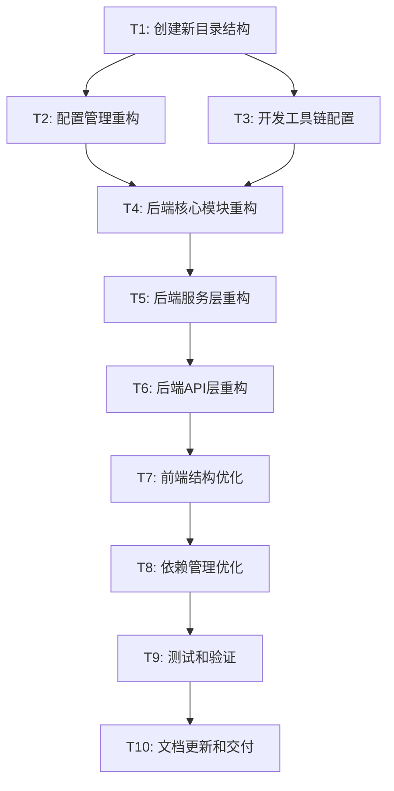

# 工程结构优化任务分解文档

## 任务依赖关系图

## 原子任务详细定义

### T1: 创建新目录结构
**任务ID**: T1  
**优先级**: 高  
**预估时间**: 2小时  

#### 输入契约
- **前置依赖**: 无
- **输入数据**: 现有项目结构
- **环境依赖**: 文件系统访问权限

#### 输出契约
- **输出数据**: 标准化的目录结构
- **交付物**: 
  - 新的backend目录结构
  - 新的frontend目录结构
  - 项目级配置目录
- **验收标准**: 
  - 目录结构符合设计文档规范
  - 所有必要的__init__.py文件已创建
  - 目录权限设置正确

#### 实现约束
- **技术栈**: 文件系统操作
- **接口规范**: 遵循Python包结构规范
- **质量要求**: 目录命名符合命名规范

#### 依赖关系
- **后置任务**: T2, T3
- **并行任务**: 无

#### 具体实施步骤
1. 创建backend/app目录结构
2. 创建frontend/src优化结构
3. 创建项目级docs、scripts、config目录
4. 添加必要的__init__.py文件
5. 设置目录权限和.gitkeep文件

---

### T2: 配置管理重构
**任务ID**: T2  
**优先级**: 高  
**预估时间**: 3小时  

#### 输入契约
- **前置依赖**: T1完成
- **输入数据**: 现有配置文件(.env, db_config.py等)
- **环境依赖**: Python 3.10.11环境

#### 输出契约
- **输出数据**: 分层配置管理系统
- **交付物**:
  - backend/config/settings/目录及配置文件
  - 环境变量管理机制
  - 配置验证和加载逻辑
- **验收标准**:
  - 支持多环境配置(dev/prod/test)
  - 配置验证机制正常工作
  - 向后兼容现有配置

#### 实现约束
- **技术栈**: Pydantic BaseSettings
- **接口规范**: 配置类接口标准化
- **质量要求**: 配置安全性和可维护性

#### 依赖关系
- **后置任务**: T4
- **并行任务**: T3

#### 具体实施步骤
1. 创建BaseSettings基础配置类
2. 实现环境特定配置类(Development/Production/Testing)
3. 创建配置加载和验证机制
4. 迁移现有配置到新体系
5. 测试配置加载功能

---

### T3: 开发工具链配置
**任务ID**: T3  
**优先级**: 中  
**预估时间**: 2小时  

#### 输入契约
- **前置依赖**: T1完成
- **输入数据**: 现有开发工具配置
- **环境依赖**: Python、Node.js开发环境

#### 输出契约
- **输出数据**: 完整的开发工具链
- **交付物**:
  - 代码格式化配置(.black, .isort, .prettierrc)
  - 代码检查配置(.flake8, eslint)
  - 预提交钩子配置
  - CI/CD工作流配置
- **验收标准**:
  - 代码质量检查正常运行
  - 格式化工具配置正确
  - CI/CD流程可执行

#### 实现约束
- **技术栈**: Black, isort, flake8, ESLint, Prettier
- **接口规范**: 标准化的工具配置格式
- **质量要求**: 工具配置一致性和有效性

#### 依赖关系
- **后置任务**: T4
- **并行任务**: T2

#### 具体实施步骤
1. 配置Python代码质量工具
2. 配置前端代码质量工具
3. 设置预提交钩子
4. 创建GitHub Actions工作流
5. 测试工具链完整性

---

### T4: 后端核心模块重构
**任务ID**: T4  
**优先级**: 高  
**预估时间**: 4小时  

#### 输入契约
- **前置依赖**: T1, T2, T3完成
- **输入数据**: 现有核心功能代码
- **环境依赖**: Python环境，数据库连接

#### 输出契约
- **输出数据**: 重构后的核心模块
- **交付物**:
  - backend/app/core/目录及核心模块
  - 数据库连接管理
  - 异常处理机制
  - 安全认证模块
- **验收标准**:
  - 核心模块功能正常
  - 数据库连接稳定
  - 异常处理完整
  - 安全机制有效

#### 实现约束
- **技术栈**: FastAPI, SQLAlchemy, Pydantic
- **接口规范**: 核心模块接口标准化
- **质量要求**: 高可用性和安全性

#### 依赖关系
- **后置任务**: T5
- **并行任务**: 无

#### 具体实施步骤
1. 创建配置管理模块(config.py)
2. 实现数据库连接管理(database.py)
3. 建立异常处理机制(exceptions.py)
4. 实现安全认证模块(security.py)
5. 创建日志系统(logging.py)

---

### T5: 后端服务层重构
**任务ID**: T5  
**优先级**: 高  
**预估时间**: 5小时  

#### 输入契约
- **前置依赖**: T4完成
- **输入数据**: 现有服务文件(control_service.py等)
- **环境依赖**: 重构后的核心模块

#### 输出契约
- **输出数据**: 标准化的服务层
- **交付物**:
  - backend/app/services/目录及服务模块
  - 服务接口抽象
  - 业务逻辑封装
  - 服务依赖注入
- **验收标准**:
  - 服务接口清晰
  - 业务逻辑正确
  - 依赖注入正常
  - 单元测试通过

#### 实现约束
- **技术栈**: FastAPI依赖注入, 异步编程
- **接口规范**: 服务接口标准化
- **质量要求**: 高内聚低耦合

#### 依赖关系
- **后置任务**: T6
- **并行任务**: 无

#### 具体实施步骤
1. 定义服务基类和接口
2. 重构ControlService
3. 重构ExportService
4. 重构AuditService
5. 实现服务依赖注入

---

### T6: 后端API层重构
**任务ID**: T6  
**优先级**: 高  
**预估时间**: 4小时  

#### 输入契约
- **前置依赖**: T5完成
- **输入数据**: 现有API路由和处理逻辑
- **环境依赖**: 重构后的服务层

#### 输出契约
- **输出数据**: 标准化的API层
- **交付物**:
  - backend/app/api/目录及API模块
  - 版本化的API路由
  - 请求/响应模型
  - API文档
- **验收标准**:
  - API接口功能正常
  - 请求验证有效
  - 响应格式标准
  - API文档完整

#### 实现约束
- **技术栈**: FastAPI, Pydantic
- **接口规范**: RESTful API设计规范
- **质量要求**: API稳定性和文档完整性

#### 依赖关系
- **后置任务**: T7
- **并行任务**: 无

#### 具体实施步骤
1. 创建API版本管理结构
2. 重构控制相关API端点
3. 重构导出相关API端点
4. 重构能源相关API端点
5. 更新API文档和测试

---

### T7: 前端结构优化
**任务ID**: T7  
**优先级**: 中  
**预估时间**: 3小时  

#### 输入契约
- **前置依赖**: T6完成
- **输入数据**: 现有前端代码结构
- **环境依赖**: Node.js环境，重构后的后端API

#### 输出契约
- **输出数据**: 优化后的前端结构
- **交付物**:
  - 优化的组件目录结构
  - TypeScript类型定义
  - API接口层重构
  - 状态管理优化
- **验收标准**:
  - 组件结构清晰
  - 类型定义完整
  - API调用正常
  - 页面功能正常

#### 实现约束
- **技术栈**: Vue 3, TypeScript, Element Plus
- **接口规范**: 组件接口标准化
- **质量要求**: 代码可维护性和类型安全

#### 依赖关系
- **后置任务**: T8
- **并行任务**: 无

#### 具体实施步骤
1. 优化组件目录结构
2. 完善TypeScript类型定义
3. 重构API接口层
4. 优化状态管理
5. 更新组件导入路径

---

### T8: 依赖管理优化
**任务ID**: T8  
**优先级**: 中  
**预估时间**: 2小时  

#### 输入契约
- **前置依赖**: T7完成
- **输入数据**: 现有依赖配置文件
- **环境依赖**: Python和Node.js包管理器

#### 输出契约
- **输出数据**: 优化的依赖管理
- **交付物**:
  - 分层的Python依赖文件
  - 优化的package.json
  - 依赖安全检查配置
  - 版本锁定文件
- **验收标准**:
  - 依赖分类清晰
  - 版本锁定有效
  - 安全检查通过
  - 安装过程顺畅

#### 实现约束
- **技术栈**: pip, npm
- **接口规范**: 标准的依赖管理格式
- **质量要求**: 依赖安全性和稳定性

#### 依赖关系
- **后置任务**: T9
- **并行任务**: 无

#### 具体实施步骤
1. 创建分层的Python依赖文件
2. 优化前端依赖配置
3. 配置依赖安全检查
4. 更新版本锁定文件
5. 测试依赖安装过程

---

### T9: 测试和验证
**任务ID**: T9  
**优先级**: 高  
**预估时间**: 4小时  

#### 输入契约
- **前置依赖**: T8完成
- **输入数据**: 重构后的完整系统
- **环境依赖**: 测试环境，数据库

#### 输出契约
- **输出数据**: 验证报告
- **交付物**:
  - 功能测试报告
  - 性能测试报告
  - 兼容性测试报告
  - 问题修复记录
- **验收标准**:
  - 所有核心功能正常
  - 性能无明显下降
  - 向后兼容性保持
  - 关键问题已修复

#### 实现约束
- **技术栈**: pytest, Jest
- **接口规范**: 测试用例标准化
- **质量要求**: 测试覆盖率>80%

#### 依赖关系
- **后置任务**: T10
- **并行任务**: 无

#### 具体实施步骤
1. 执行后端功能测试
2. 执行前端功能测试
3. 进行集成测试
4. 性能基准测试
5. 修复发现的问题

---

### T10: 文档更新和交付
**任务ID**: T10  
**优先级**: 中  
**预估时间**: 3小时  

#### 输入契约
- **前置依赖**: T9完成
- **输入数据**: 重构后的系统和测试结果
- **环境依赖**: 文档编写环境

#### 输出契约
- **输出数据**: 完整的项目文档
- **交付物**:
  - 更新的README.md
  - 架构文档
  - 开发指南
  - 部署文档
  - 变更记录
- **验收标准**:
  - 文档内容准确
  - 结构清晰易懂
  - 示例代码有效
  - 部署指南可执行

#### 实现约束
- **技术栈**: Markdown
- **接口规范**: 文档结构标准化
- **质量要求**: 文档完整性和准确性

#### 依赖关系
- **后置任务**: 无
- **并行任务**: 无

#### 具体实施步骤
1. 更新项目README
2. 完善架构文档
3. 编写开发指南
4. 更新部署文档
5. 记录变更历史

## 任务执行计划

### 第一阶段：基础设施搭建（预计1天）
- **时间**: 第1天
- **任务**: T1, T2, T3
- **目标**: 建立新的项目结构和开发工具链
- **里程碑**: 新目录结构创建完成，配置管理体系建立

### 第二阶段：后端重构（预计2天）
- **时间**: 第2-3天
- **任务**: T4, T5, T6
- **目标**: 完成后端架构重构
- **里程碑**: 后端API正常运行，核心功能验证通过

### 第三阶段：前端优化和集成（预计1天）
- **时间**: 第4天
- **任务**: T7, T8
- **目标**: 完成前端结构优化和依赖管理
- **里程碑**: 前后端集成正常，页面功能完整

### 第四阶段：测试和交付（预计1天）
- **时间**: 第5天
- **任务**: T9, T10
- **目标**: 完成系统测试和文档更新
- **里程碑**: 系统稳定运行，文档完整交付

## 风险控制措施

### 高风险任务
- **T4**: 后端核心模块重构 - 可能影响系统稳定性
- **T5**: 后端服务层重构 - 可能影响业务逻辑
- **T9**: 测试和验证 - 可能发现重大问题

### 风险缓解策略
1. **备份策略**: 每个阶段开始前创建代码备份
2. **渐进式迁移**: 保持旧代码可用，逐步切换
3. **持续测试**: 每个任务完成后立即进行功能验证
4. **回滚计划**: 每个阶段都有明确的回滚方案

## 质量保证措施

### 代码质量
- 每个任务完成后进行代码审查
- 运行自动化代码质量检查
- 确保测试覆盖率达标

### 功能质量
- 每个模块重构后立即测试
- 保持API接口向后兼容
- 验证核心业务流程完整性

### 文档质量
- 同步更新相关文档
- 确保文档与代码一致
- 提供清晰的使用示例