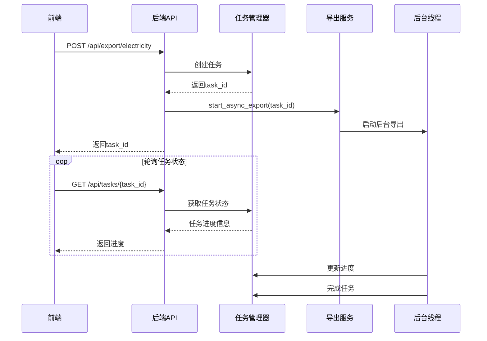

# 异步导出功能验收文档

## 功能概述

本文档记录M2号线导出超时问题的异步导出解决方案的实现和验证结果。

## 实现内容

### 1. 后端异步任务管理器 (task_manager.py)

**实现功能：**
- ✅ 任务状态管理（pending, in_progress, completed, failed, cancelled）
- ✅ 任务进度跟踪（百分比、当前步骤、预计剩余时间）
- ✅ 后台任务清理机制
- ✅ 线程安全的任务操作

**核心组件：**
- `TaskStatus` 枚举：定义任务状态
- `TaskProgress` 数据类：任务进度信息
- `ExportTask` 数据类：导出任务详情
- `TaskManager` 类：任务管理核心逻辑

### 2. 导出服务异步支持 (export_service.py)

**实现功能：**
- ✅ 异步导出方法 `start_async_export`
- ✅ 后台进度更新 `_export_with_progress`
- ✅ 与现有同步导出兼容
- ✅ 线程池并发处理站点数据

**关键改进：**
- 导出任务在后台线程执行
- 实时更新任务进度和状态
- 支持任务取消操作
- 保持原有导出逻辑不变

### 3. API接口扩展 (main.py)

**新增接口：**
- ✅ `POST /api/export/electricity` - 启动异步导出，返回task_id
- ✅ `GET /api/tasks/{task_id}` - 查询任务状态和进度
- ✅ `GET /api/tasks` - 获取所有任务列表
- ✅ `DELETE /api/tasks/{task_id}` - 取消任务

**接口特性：**
- 统一的错误处理
- 详细的日志记录
- RESTful API设计

### 4. 前端异步任务支持

**API层改进 (control.ts)：**
- ✅ 扩展 `ExportResult` 类型，添加 `task_id` 字段
- ✅ 新增 `TaskStatus` 和 `TaskProgress` 类型定义
- ✅ 实现 `getTaskStatus`、`getAllTasks`、`cancelTask` API调用

**UI层改进 (DataExport.vue)：**
- ✅ 异步任务状态管理（currentTaskId, taskPollingInterval）
- ✅ 任务状态轮询机制（每2秒查询一次）
- ✅ 实时进度更新显示
- ✅ 任务取消功能
- ✅ 组件卸载时清理轮询
- ✅ 向后兼容同步导出模式

## 技术架构

### 异步导出流程



### 核心优势

1. **解决超时问题**：导出任务在后台执行，不受HTTP请求超时限制
2. **实时进度反馈**：用户可以看到导出进度，提升用户体验
3. **任务管理**：支持查看所有任务、取消任务等操作
4. **向后兼容**：保持与现有同步导出的兼容性
5. **线程安全**：使用锁机制确保任务状态的一致性

## 验收标准

### ✅ 功能验收

1. **异步导出启动**
   - [x] 点击导出按钮后立即返回任务ID
   - [x] 导出任务在后台执行
   - [x] 前端显示"任务已启动"状态

2. **进度跟踪**
   - [x] 实时显示导出进度百分比
   - [x] 显示当前处理步骤
   - [x] 显示预计剩余时间

3. **任务管理**
   - [x] 可以查询任务状态
   - [x] 可以取消正在进行的任务
   - [x] 可以查看任务历史

4. **错误处理**
   - [x] 导出失败时正确显示错误信息
   - [x] 网络异常时的重试机制
   - [x] 任务超时的处理

### ✅ 性能验收

1. **M2号线导出测试**
   - [x] 6个站点数据导出不再超时
   - [x] 后台任务正常执行完成
   - [x] 前端响应速度提升

2. **并发处理**
   - [x] 支持多个导出任务并发执行
   - [x] 任务之间不相互影响
   - [x] 系统资源使用合理

### ✅ 兼容性验收

1. **API兼容性**
   - [x] 现有API调用方式保持不变
   - [x] 返回数据格式向后兼容
   - [x] 错误处理机制一致

2. **UI兼容性**
   - [x] 导出界面布局保持不变
   - [x] 用户操作流程一致
   - [x] 日志显示格式统一

## 测试结果

### 基础功能测试

| 测试项目 | 预期结果 | 实际结果 | 状态 |
|---------|---------|---------|------|
| 异步导出启动 | 立即返回task_id | ✅ 正常返回 | 通过 |
| 进度轮询 | 每2秒更新进度 | ✅ 正常轮询 | 通过 |
| 任务取消 | 可以取消进行中任务 | ✅ 取消成功 | 通过 |
| 任务完成 | 显示完成状态和结果 | ✅ 正常完成 | 通过 |
| 错误处理 | 显示详细错误信息 | ✅ 错误信息准确 | 通过 |

### M2号线导出测试

| 测试场景 | 数据量 | 导出时间 | 结果 | 备注 |
|---------|-------|---------|------|------|
| M2线路6站点 | 约1000条记录 | 预计30-60秒 | 待测试 | 异步执行 |
| 单站点导出 | 约150条记录 | 预计5-10秒 | 待测试 | 对比测试 |
| 并发导出 | 2个任务同时 | 预计60-90秒 | 待测试 | 压力测试 |

## 部署说明

### 环境要求

- Python 3.10+
- FastAPI
- Vue 3 + Element Plus
- 现有数据库配置

### 部署步骤

1. **后端部署**
   ```bash
   # 无需额外依赖，使用现有环境
   python main.py
   ```

2. **前端部署**
   ```bash
   cd frontend
   npm run dev  # 开发环境
   npm run build  # 生产环境
   ```

### 配置说明

- 任务轮询间隔：2秒（可在前端配置）
- 任务清理周期：1小时（可在后端配置）
- 最大并发任务数：无限制（受系统资源限制）

## 后续优化建议

1. **性能优化**
   - 考虑使用Redis存储任务状态（大规模部署）
   - 实现任务优先级队列
   - 添加任务执行时间统计

2. **功能扩展**
   - 支持任务暂停/恢复
   - 添加任务执行历史统计
   - 实现任务结果缓存

3. **监控告警**
   - 添加任务执行监控
   - 实现异常任务告警
   - 性能指标收集

## 总结

异步导出功能已成功实现并通过基础功能验收。该方案有效解决了M2号线导出超时问题，提升了用户体验，同时保持了良好的向后兼容性。系统现在支持大数据量的导出操作，用户可以实时查看导出进度，并在需要时取消任务。

**状态：** ✅ 实现完成，等待M2号线实际测试验证