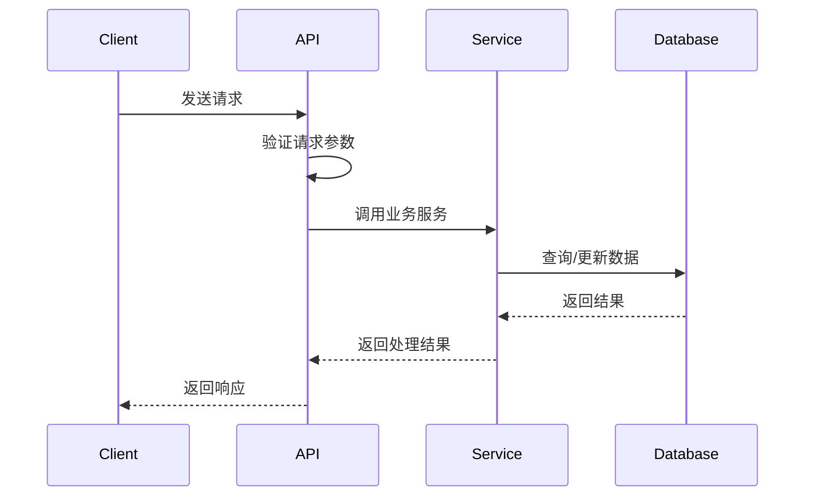

# API Spec: {API 名称}

## 元数据

| 项目 | 内容 |
|------|------|
| **规格编号** | SPEC-API-{模块}-{功能}-{日期} |
| **规格版本** | v1.0.0 |
| **创建日期** | YYYY-MM-DD |
| **作者** | {作者姓名} |
| **状态** | Draft / Review / Approved / Implemented |

## 版本历史

| 版本 | 日期 | 作者 | 变更说明 |
|------|------|------|----------|
| v1.0.0 | YYYY-MM-DD | {作者} | 初始版本 |

## 1. 功能概述

### 1.1 功能描述

{简要描述 API 的功能和用途}

### 1.2 业务价值

{说明此 API 解决什么业务问题，带来什么价值}

### 1.3 使用场景

- 场景1: {描述使用场景}
- 场景2: {描述使用场景}

## 2. 接口定义

### 2.1 接口基本信息

| 项目 | 内容 |
|------|------|
| **接口路径** | `/api/v1/{resource}` |
| **请求方法** | GET / POST / PUT / DELETE / PATCH |
| **认证要求** | Required / Optional / None |
| **权限要求** | {所需的权限级别} |
| **限流规则** | {请求频率限制} |

### 2.2 请求规格

#### 2.2.1 请求头（Request Headers）

| 头字段 | 类型 | 必填 | 说明 |
|--------|------|------|------|
| Authorization | string | 是 | Bearer token |
| Content-Type | string | 是 | application/json |

#### 2.2.2 路径参数（Path Parameters）

| 参数名 | 类型 | 必填 | 说明 | 示例 |
|--------|------|------|------|------|
| id | integer | 是 | 资源ID | 123 |

#### 2.2.3 查询参数（Query Parameters）

| 参数名 | 类型 | 必填 | 默认值 | 说明 | 示例 |
|--------|------|------|--------|------|------|
| page | integer | 否 | 1 | 页码 | 1 |
| page_size | integer | 否 | 20 | 每页数量 | 20 |
| sort_by | string | 否 | created_at | 排序字段 | name |
| order | string | 否 | desc | 排序方向：asc/desc | asc |

#### 2.2.4 请求体（Request Body）

**Content-Type**: `application/json`

**JSON Schema**:

```json
{
  "type": "object",
  "required": ["field1", "field2"],
  "properties": {
    "field1": {
      "type": "string",
      "description": "字段1说明",
      "minLength": 1,
      "maxLength": 100
    },
    "field2": {
      "type": "integer",
      "description": "字段2说明",
      "minimum": 0,
      "maximum": 100
    },
    "field3": {
      "type": "array",
      "description": "字段3说明",
      "items": {
        "type": "string"
      }
    }
  }
}
```

**字段说明**:

| 字段名 | 类型 | 必填 | 约束 | 说明 |
|--------|------|------|------|------|
| field1 | string | 是 | 1-100字符 | 字段1的详细说明 |
| field2 | integer | 是 | 0-100 | 字段2的详细说明 |
| field3 | array[string] | 否 | - | 字段3的详细说明 |

### 2.3 响应规格

#### 2.3.1 响应头（Response Headers）

| 头字段 | 类型 | 说明 |
|--------|------|------|
| Content-Type | string | application/json |
| X-Request-ID | string | 请求追踪ID |

#### 2.3.2 成功响应（Success Response）

**状态码**: `200 OK`

**JSON Schema**:

```json
{
  "type": "object",
  "required": ["code", "message", "data"],
  "properties": {
    "code": {
      "type": "integer",
      "enum": [0]
    },
    "message": {
      "type": "string"
    },
    "data": {
      "type": "object",
      "properties": {
        "id": {
          "type": "integer"
        },
        "name": {
          "type": "string"
        },
        "created_at": {
          "type": "string",
          "format": "date-time"
        }
      }
    }
  }
}
```

**响应字段说明**:

| 字段路径 | 类型 | 说明 |
|----------|------|------|
| code | integer | 响应码，0表示成功 |
| message | string | 响应消息 |
| data | object | 响应数据 |
| data.id | integer | 资源ID |
| data.name | string | 资源名称 |
| data.created_at | string | 创建时间（ISO 8601格式） |

#### 2.3.3 错误响应（Error Response）

**状态码**: `4xx` / `5xx`

**JSON Schema**:

```json
{
  "type": "object",
  "required": ["code", "message"],
  "properties": {
    "code": {
      "type": "integer"
    },
    "message": {
      "type": "string"
    },
    "errors": {
      "type": "array",
      "items": {
        "type": "object",
        "properties": {
          "field": {
            "type": "string"
          },
          "message": {
            "type": "string"
          }
        }
      }
    }
  }
}
```

## 3. 业务逻辑

### 3.1 处理流程



### 3.2 业务规则

1. **规则1**: {描述业务规则}
2. **规则2**: {描述业务规则}

### 3.3 数据验证

- **参数验证**: {描述参数验证规则}
- **业务验证**: {描述业务验证规则}
- **权限验证**: {描述权限验证规则}

### 3.4 事务处理

{描述事务处理要求}

## 4. 错误处理

### 4.1 错误码定义

| 错误码 | HTTP状态码 | 错误信息 | 说明 | 处理建议 |
|--------|-----------|----------|------|----------|
| 1001 | 400 | Invalid parameter | 参数无效 | 检查请求参数 |
| 1002 | 401 | Unauthorized | 未授权 | 检查认证信息 |
| 1003 | 403 | Forbidden | 禁止访问 | 检查权限 |
| 1004 | 404 | Resource not found | 资源不存在 | 检查资源ID |
| 1005 | 409 | Resource conflict | 资源冲突 | 检查资源状态 |
| 1006 | 429 | Too many requests | 请求过多 | 降低请求频率 |
| 5001 | 500 | Internal server error | 服务器内部错误 | 联系技术支持 |

### 4.2 异常场景

| 场景 | 错误码 | 处理方式 |
|------|--------|----------|
| 参数格式错误 | 1001 | 返回参数验证错误信息 |
| Token过期 | 1002 | 返回401，提示重新登录 |
| 无权限访问 | 1003 | 返回403，提示权限不足 |
| 资源不存在 | 1004 | 返回404，提示资源未找到 |
| 数据库连接失败 | 5001 | 返回500，记录日志 |

## 5. 性能要求

### 5.1 响应时间

| 场景 | 目标响应时间 | 最大响应时间 |
|------|-------------|-------------|
| 正常情况 | < 200ms | < 500ms |
| 高负载 | < 500ms | < 1000ms |

### 5.2 并发处理

- **并发用户数**: {目标并发数}
- **QPS**: {每秒请求数}
- **TPS**: {每秒事务数}

### 5.3 数据量

- **单次请求数据量**: {最大数据量}
- **分页大小**: {默认/最大分页大小}

## 6. 安全要求

### 6.1 认证

- **认证方式**: {JWT / OAuth2 / API Key}
- **Token有效期**: {有效期}
- **Token刷新机制**: {刷新机制}

### 6.2 授权

- **权限模型**: {RBAC / ACL}
- **所需权限**: {具体权限列表}

### 6.3 数据安全

- **敏感数据加密**: {加密要求}
- **数据脱敏**: {脱敏要求}
- **SQL注入防护**: {防护措施}
- **XSS防护**: {防护措施}

### 6.4 限流

- **IP限流**: {限流规则}
- **用户限流**: {限流规则}
- **API限流**: {限流规则}

## 7. 示例

### 7.1 请求示例

**cURL**:

```bash
curl -X POST \
  http://api.example.com/api/v1/resource \
  -H 'Authorization: Bearer {token}' \
  -H 'Content-Type: application/json' \
  -d '{
    "field1": "value1",
    "field2": 42,
    "field3": ["item1", "item2"]
  }'
```

**Python**:

```python
import requests

url = "http://api.example.com/api/v1/resource"
headers = {
    "Authorization": "Bearer {token}",
    "Content-Type": "application/json"
}
data = {
    "field1": "value1",
    "field2": 42,
    "field3": ["item1", "item2"]
}

response = requests.post(url, headers=headers, json=data)
print(response.json())
```

**JavaScript**:

```javascript
fetch('http://api.example.com/api/v1/resource', {
  method: 'POST',
  headers: {
    'Authorization': 'Bearer {token}',
    'Content-Type': 'application/json'
  },
  body: JSON.stringify({
    field1: 'value1',
    field2: 42,
    field3: ['item1', 'item2']
  })
})
.then(response => response.json())
.then(data => console.log(data));
```

### 7.2 成功响应示例

```json
{
  "code": 0,
  "message": "Success",
  "data": {
    "id": 123,
    "name": "Resource Name",
    "field1": "value1",
    "field2": 42,
    "field3": ["item1", "item2"],
    "created_at": "2025-01-01T12:00:00Z",
    "updated_at": "2025-01-01T12:00:00Z"
  }
}
```

### 7.3 错误响应示例

**参数验证错误**:

```json
{
  "code": 1001,
  "message": "Invalid parameter",
  "errors": [
    {
      "field": "field1",
      "message": "field1 is required"
    },
    {
      "field": "field2",
      "message": "field2 must be between 0 and 100"
    }
  ]
}
```

**认证失败**:

```json
{
  "code": 1002,
  "message": "Unauthorized",
  "errors": [
    {
      "field": "authorization",
      "message": "Invalid or expired token"
    }
  ]
}
```

## 8. 测试用例

### 8.1 正常场景测试

| 测试用例ID | 测试描述 | 输入 | 期望输出 |
|-----------|---------|------|---------|
| TC001 | 创建资源成功 | 合法的请求参数 | 返回200，包含创建的资源信息 |
| TC002 | 查询资源成功 | 存在的资源ID | 返回200，包含资源详情 |

### 8.2 异常场景测试

| 测试用例ID | 测试描述 | 输入 | 期望输出 |
|-----------|---------|------|---------|
| TC101 | 参数缺失 | 缺少必填参数 | 返回400，提示参数缺失 |
| TC102 | 参数格式错误 | 错误的参数格式 | 返回400，提示参数格式错误 |
| TC103 | 未授权访问 | 无效的Token | 返回401，提示未授权 |
| TC104 | 无权限访问 | 有效Token但无权限 | 返回403，提示无权限 |
| TC105 | 资源不存在 | 不存在的资源ID | 返回404，提示资源不存在 |

### 8.3 性能测试

| 测试用例ID | 测试描述 | 测试条件 | 期望结果 |
|-----------|---------|---------|---------|
| PT001 | 响应时间测试 | 正常负载 | 响应时间 < 200ms |
| PT002 | 并发测试 | 100并发用户 | 成功率 > 99% |
| PT003 | 压力测试 | 持续高负载 | 系统稳定运行 |

## 9. 验收标准

### 9.1 功能验收

- [ ] 所有正常场景测试用例通过
- [ ] 所有异常场景测试用例通过
- [ ] API 接口与规格定义完全一致
- [ ] 错误处理符合规格要求

### 9.2 性能验收

- [ ] 响应时间满足性能要求
- [ ] 并发处理能力满足要求
- [ ] 无内存泄漏或性能退化

### 9.3 安全验收

- [ ] 认证授权机制正常工作
- [ ] 通过安全扫描，无高危漏洞
- [ ] 敏感数据已加密或脱敏
- [ ] 限流机制正常工作

### 9.4 文档验收

- [ ] API 文档完整准确
- [ ] 示例代码可正常运行
- [ ] 错误码文档完整

## 10. 依赖关系

### 10.1 依赖的服务

| 服务名称 | 版本 | 用途 | 影响 |
|---------|------|------|------|
| {服务1} | v1.0 | {用途说明} | {影响说明} |

### 10.2 依赖的数据模型

| 模型名称 | 版本 | 用途 |
|---------|------|------|
| {模型1} | v1.0 | {用途说明} |

### 10.3 依赖的配置

| 配置项 | 默认值 | 说明 |
|-------|--------|------|
| {配置1} | {默认值} | {说明} |

## 11. 附录

### 11.1 相关文档

- [相关API规格](./RELATED_API_SPEC.md)
- [数据模型规格](../models/MODEL_SPEC.md)
- [业务流程文档](../../docs/BUSINESS_PROCESS.md)

### 11.2 术语表

| 术语 | 定义 |
|------|------|
| {术语1} | {定义} |

### 11.3 注意事项

- 注意事项1
- 注意事项2

---

**审核状态**: [ ] 待审核 / [ ] 已审核 / [ ] 已批准  
**实现状态**: [ ] 未实现 / [ ] 开发中 / [ ] 已完成 / [ ] 已上线  
**最后更新**: YYYY-MM-DD  
**维护者**: {维护者姓名}
