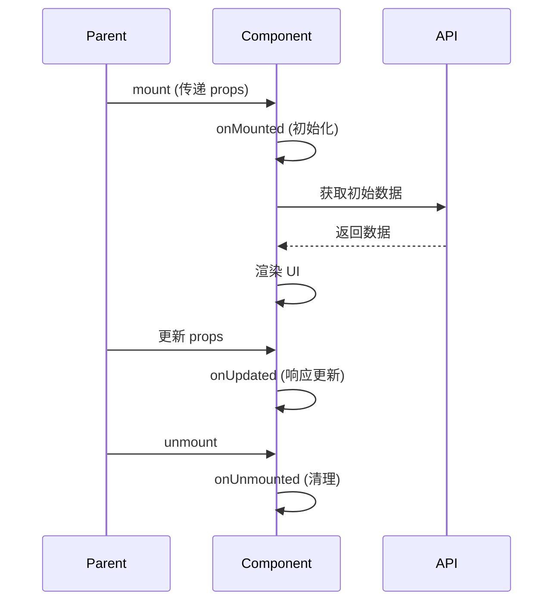
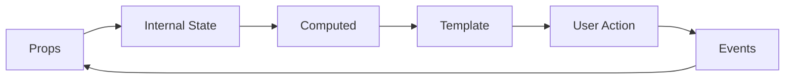

# 组件规格: {组件名称}

## 元数据

| 项目 | 内容 |
|------|------|
| **规格编号** | SPEC-COMPONENT-{模块}-{组件}-{日期} |
| **规格版本** | v1.0.0 |
| **创建日期** | YYYY-MM-DD |
| **作者** | {作者姓名} |
| **状态** | Draft / Review / Approved / Implemented |

## 版本历史

| 版本 | 日期 | 作者 | 变更说明 |
|------|------|------|----------|
| v1.0.0 | YYYY-MM-DD | {作者} | 初始版本 |

## 1. 组件概述

### 1.1 组件描述

{简要描述组件的功能和用途}

### 1.2 业务价值

{说明组件解决什么问题，带来什么价值}

### 1.3 使用场景

- 场景1: {描述}
- 场景2: {描述}

### 1.4 组件类型

- [ ] 业务组件
- [ ] 基础组件
- [ ] 布局组件
- [ ] 容器组件

## 2. 组件接口

### 2.1 Props 定义

| Prop名称 | 类型 | 必填 | 默认值 | 说明 | 示例 |
|----------|------|------|--------|------|------|
| title | String | 否 | '' | 标题 | '设备列表' |
| data | Array | 是 | - | 数据源 | [{id: 1, name: 'device1'}] |
| loading | Boolean | 否 | false | 加载状态 | true |
| disabled | Boolean | 否 | false | 禁用状态 | false |

#### Props 类型定义（TypeScript）

```typescript
interface {Component}Props {
  title?: string
  data: Array<{
    id: number
    name: string
  }>
  loading?: boolean
  disabled?: boolean
  onUpdate?: (data: any) => void
}
```

### 2.2 Events 定义

| Event名称 | 参数 | 参数类型 | 触发时机 | 说明 |
|-----------|------|----------|----------|------|
| change | value | any | 值变化时 | 通知父组件值已改变 |
| submit | formData | Object | 提交表单时 | 提交表单数据 |
| cancel | - | - | 取消操作时 | 取消操作 |

#### Events 类型定义（TypeScript）

```typescript
interface {Component}Events {
  (e: 'change', value: any): void
  (e: 'submit', formData: Record<string, any>): void
  (e: 'cancel'): void
}
```

### 2.3 Slots 定义

| Slot名称 | 作用域插槽参数 | 说明 | 示例 |
|----------|---------------|------|------|
| default | - | 默认插槽 | `<template #default>内容</template>` |
| header | title: string | 头部插槽 | `<template #header="{ title }">{{ title }}</template>` |
| footer | - | 底部插槽 | `<template #footer>操作按钮</template>` |

### 2.4 Expose 方法

| 方法名 | 参数 | 返回值 | 说明 | 示例 |
|--------|------|--------|------|------|
| refresh | - | void | 刷新组件数据 | `componentRef.refresh()` |
| validate | - | Promise<boolean> | 验证表单 | `await componentRef.validate()` |
| reset | - | void | 重置组件状态 | `componentRef.reset()` |

## 3. 组件状态

### 3.1 内部状态（data/ref）

| 状态名 | 类型 | 初始值 | 说明 |
|--------|------|--------|------|
| internalValue | any | null | 内部维护的值 |
| isLoading | boolean | false | 加载状态 |
| errorMessage | string | '' | 错误信息 |

### 3.2 计算属性（computed）

| 计算属性名 | 类型 | 说明 | 依赖 |
|-----------|------|------|------|
| displayValue | string | 显示值 | internalValue |
| isValid | boolean | 是否有效 | internalValue, rules |

### 3.3 响应式数据

```typescript
interface {Component}State {
  internalValue: any
  isLoading: boolean
  errorMessage: string
}
```

## 4. 业务逻辑

### 4.1 生命周期



### 4.2 核心方法

| 方法名 | 参数 | 返回值 | 说明 |
|--------|------|--------|------|
| fetchData | - | Promise<void> | 获取数据 |
| handleChange | value: any | void | 处理值变化 |
| validate | - | Promise<boolean> | 验证数据 |

### 4.3 数据流



### 4.4 交互流程

- 用户操作 -> 触发方法 -> 更新状态 -> 触发计算属性 -> 更新视图
- 用户操作 -> 触发事件 -> 通知父组件

## 5. 样式规格

### 5.1 CSS 类名

| 类名 | 说明 | 应用元素 |
|------|------|----------|
| .{component} | 组件根元素 | 根元素 |
| .{component}__header | 头部元素 | 头部容器 |
| .{component}__body | 主体元素 | 主体容器 |
| .{component}__footer | 底部元素 | 底部容器 |
| .{component}--disabled | 禁用状态修饰符 | 根元素 |

### 5.2 BEM 命名规范

```
.{component}                          // 块
.{component}__element                 // 元素
.{component}--modifier                // 修饰符
.{component}__element--modifier       // 元素的修饰符
```

### 5.3 主题变量

| CSS 变量 | 默认值 | 说明 |
|----------|--------|------|
| --{component}-bg-color | #ffffff | 背景色 |
| --{component}-text-color | #333333 | 文字色 |
| --{component}-border-color | #dcdfe6 | 边框色 |
| --{component}-hover-color | #409eff | 悬停色 |

### 5.4 响应式设计

| 断点 | 屏幕宽度 | 样式调整 |
|------|----------|----------|
| xs | < 768px | 单列布局 |
| sm | ≥ 768px | 双列布局 |
| md | ≥ 992px | 三列布局 |
| lg | ≥ 1200px | 四列布局 |

## 6. 依赖关系

### 6.1 依赖的组件

| 组件名 | 版本 | 用途 |
|--------|------|------|
| el-button | - | 按钮操作 |
| el-table | - | 数据展示 |

### 6.2 依赖的 Composables

| Composable | 用途 |
|-----------|------|
| useDevice | 设备数据管理 |
| useAuth | 权限验证 |

### 6.3 依赖的 Store

| Store | 用途 |
|-------|------|
| useAppStore | 应用状态 |
| useUserStore | 用户信息 |

### 6.4 依赖的 API

| API 接口 | 用途 |
|----------|------|
| GET /api/devices | 获取设备列表 |
| POST /api/devices | 创建设备 |

## 7. 非功能性要求

### 7.1 性能要求

| 指标 | 目标值 | 说明 |
|------|--------|------|
| 首次渲染时间 | < 200ms | 组件初始化时间 |
| 交互响应时间 | < 100ms | 用户操作响应时间 |
| 内存占用 | < 10MB | 单个组件实例内存占用 |

### 7.2 可访问性（A11y）

- [ ] 支持键盘导航
- [ ] 支持屏幕阅读器
- [ ] 提供适当的 ARIA 属性
- [ ] 支持高对比度模式

### 7.3 浏览器兼容性

| 浏览器 | 最低版本 |
|--------|----------|
| Chrome | 90+ |
| Firefox | 88+ |
| Safari | 14+ |
| Edge | 90+ |

## 8. 使用示例

### 8.1 基本用法

```vue
<template>
  <{Component}
    :data="deviceList"
    :loading="isLoading"
    @change="handleChange"
    @submit="handleSubmit"
  />
</template>

<script setup lang="ts">
import { ref } from 'vue'
import {Component} from '@/components'

const deviceList = ref([
  { id: 1, name: 'Device 1' },
  { id: 2, name: 'Device 2' }
])
const isLoading = ref(false)

const handleChange = (value: any) => {
  console.log('Changed:', value)
}

const handleSubmit = (formData: Record<string, any>) => {
  console.log('Submitted:', formData)
}
</script>
```

### 8.2 自定义插槽

```vue
<template>
  <{Component} :data="deviceList">
    <template #header="{ title }">
      <div class="custom-header">
        <h2>{{ title }}</h2>
        <el-button>自定义按钮</el-button>
      </div>
    </template>

    <template #footer>
      <div class="custom-footer">
        <el-button @click="handleCancel">取消</el-button>
        <el-button type="primary" @click="handleConfirm">确定</el-button>
      </div>
    </template>
  </{Component}>
</template>
```

### 8.3 使用 Ref 方法

```vue
<template>
  <{Component} ref="componentRef" :data="deviceList" />
  <el-button @click="refreshComponent">刷新</el-button>
</template>

<script setup lang="ts">
import { ref } from 'vue'
import {Component} from '@/components'

const componentRef = ref()

const refreshComponent = () => {
  componentRef.value?.refresh()
}
</script>
```

## 9. 测试用例

### 9.1 单元测试

| 测试用例ID | 测试描述 | 测试步骤 | 期望结果 |
|-----------|---------|---------|---------|
| TC_COMP_001 | 组件正常渲染 | 传入正常 props | 组件正常显示 |
| TC_COMP_002 | Props 响应式更新 | 更新 props | 组件内容更新 |
| TC_COMP_003 | 事件触发 | 用户操作 | 正确触发事件 |

#### 测试代码示例

```typescript
import { mount } from '@vue/test-utils'
import {Component} from '@/components/{Component}.vue'

describe('{Component}', () => {
  it('should render correctly', () => {
    const wrapper = mount({Component}, {
      props: {
        data: [{ id: 1, name: 'Test' }]
      }
    })
    expect(wrapper.find('.{component}').exists()).toBe(true)
  })

  it('should emit change event', async () => {
    const wrapper = mount({Component}, {
      props: {
        data: [{ id: 1, name: 'Test' }]
      }
    })
    await wrapper.find('input').setValue('new value')
    expect(wrapper.emitted('change')).toBeTruthy()
  })
})
```

### 9.2 集成测试

| 测试用例ID | 场景 | 测试步骤 | 期望结果 |
|-----------|------|---------|---------|
| TC_COMP_101 | 与父组件交互 | 父组件更新数据 | 子组件正确响应 |

### 9.3 可视化测试

- [ ] 基本状态截图
- [ ] 加载状态截图
- [ ] 错误状态截图
- [ ] 禁用状态截图

## 10. 验收标准

### 10.1 功能验收

- [ ] 所有 Props 正常工作
- [ ] 所有 Events 正常触发
- [ ] 所有 Slots 正常使用
- [ ] 所有 Expose 方法正常工作

### 10.2 样式验收

- [ ] 样式符合设计规范
- [ ] 响应式布局正常
- [ ] 主题切换正常
- [ ] 深色模式正常（如适用）

### 10.3 性能验收

- [ ] 首次渲染时间满足要求
- [ ] 无内存泄漏
- [ ] 大数据量渲染流畅

### 10.4 可访问性验收

- [ ] 键盘导航正常
- [ ] 屏幕阅读器支持
- [ ] ARIA 属性完整

## 11. 文档与注释

### 11.1 代码注释

```typescript
/**
 * {组件名称}
 * 
 * @description {组件描述}
 * @example
 * ```vue
 * <{Component} :data="data" @change="handleChange" />
 * ```
 */
```

### 11.2 JSDoc 注释

```typescript
/**
 * 处理变化事件
 * @param {any} value - 新的值
 * @returns {void}
 */
const handleChange = (value: any): void => {
  // 实现
}
```

## 12. 注意事项

- 注意事项1: {说明}
- 注意事项2: {说明}

## 13. 附录

### 13.1 相关文档

- [组件设计规范](../../docs/COMPONENT_DESIGN_GUIDE.md)
- [样式指南](../../docs/STYLE_GUIDE.md)

### 13.2 参考组件

- [类似组件1](./COMPONENT_1.md)
- [类似组件2](./COMPONENT_2.md)

---

**审核状态**: [ ] 待审核 / [ ] 已审核 / [ ] 已批准  
**实现状态**: [ ] 未实现 / [ ] 开发中 / [ ] 已完成 / [ ] 已上线  
**最后更新**: YYYY-MM-DD  
**维护者**: {维护者姓名}
